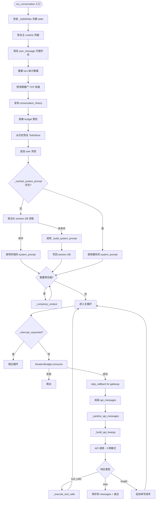
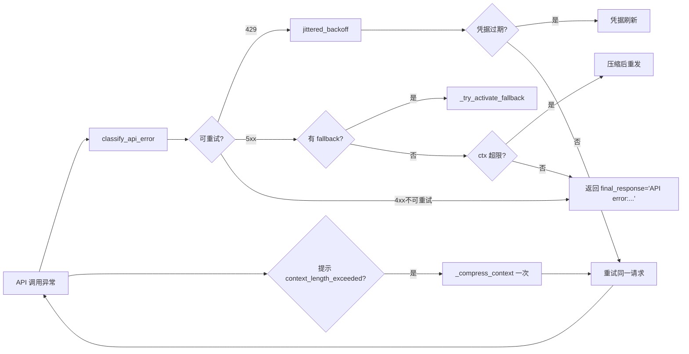

# Agent Execution Layer 分析文档

> 分析对象：`run_agent.py` 中 `AIAgent.run_conversation()` 主循环、`agent/prompt_builder.py` 系统提示词组装、`model_tools.py` 工具注册与派发
> 文件路径：
> - `D:\DevSpace\person\ai_space\hermes-agent\run_agent.py`
> - `D:\DevSpace\person\ai_space\hermes-agent\agent\prompt_builder.py`
> - `D:\DevSpace\person\ai_space\hermes-agent\model_tools.py`

---

## 1. 业务背景

### 1.1 这一层解决什么问题

Agent Execution Layer（执行层）位于 Hermes Agent 整个对话链路的核心位置，负责把"用户输入"和"会话历史"转换为一次真正的 LLM 调用，并把模型返回的工具调用安全、可控、可重入地映射到本地工具实现上。它的核心问题有四个：

1. **多 Provider 适配**：同时支持 OpenAI Chat Completions、OpenAI Codex Responses、Anthropic Messages 三种 API 模式，且每种模式的字段名（`reasoning_content` vs `reasoning_details` vs `thinking`）、工具调用结构、prompt caching 标记方式都不同。
2. **工具调用的并行性决策**：模型可能在一轮里吐多个 `tool_calls`（比如同时 `read_file` 三个不同文件），需要判断哪些可以并发、哪些必须串行、哪些永远不能并行。
3. **提示词缓存（Prompt Caching）**：Anthropic/OpenAI 的 prefix cache 命中率直接决定成本和延迟，而系统提示词里有大量"会话级稳定内容"（SOUL、AGENTS.md、Skills 索引、Memory 快照），如何让这些内容在每一轮都保持字节级一致是性能关键。
4. **Agent 级工具拦截**：todo、memory、session_search、delegate_task、clarify 这五个工具**不能**走通用注册表派发，因为它们需要访问 `self._todo_store`、`self._memory_store`、`self._session_db`、`self.clarify_callback` 等 agent 实例状态；model_tools.py 在派发层用 stub 拒收，run_agent.py 在调用层真正执行。

### 1.2 在整体对话流中的位置

```
┌────────────────────────────────────────────────────────────────┐
│  User Input Layer        (cli.py / gateway/run.py)             │
│  - prompt_toolkit / platform adapter                          │
│  - 拼出 user_message + conversation_history                   │
└────────────────┬───────────────────────────────────────────────┘
                 │
                 ▼
┌────────────────────────────────────────────────────────────────┐
│  Session Persistence Layer (hermes_state.py + FTS5)            │
│  - 加载历史 messages、system_prompt 快照、session row          │
└────────────────┬───────────────────────────────────────────────┘
                 │
                 ▼
   ★★★  Agent Execution Layer  ★★★
   - AIAgent.run_conversation() 主循环
   - _build_system_prompt() 7 层组装
   - _build_api_kwargs() 3 种 API 模式适配
   - _execute_tool_calls() 并行/串行决策
   - _invoke_tool() Agent 级工具拦截
   - 上下文压缩、错误重试、fallback
                 │
                 ▼
┌────────────────────────────────────────────────────────────────┐
│  Gateway Response Layer (gateway/run.py + 各 platform)        │
│  - 解析 final_response、发送附件、stream delta                │
└────────────────────────────────────────────────────────────────┘
```

### 1.3 关键用户可见行为

- 多轮工具调用直到模型主动停止（`max_iterations` 默认 90）
- 在 CLI 安静模式下出现 kawaii spinner
- 工具调用结果显示 emoji 进度（📞、⚡、🔀）
- 上下文超阈值时自动压缩，提示"📦 Preflight compression"
- 失败时自动重试、refresh 凭据、切换到 fallback 模型
- 中断时立即停止后续工具调用，已发出的 tool_call 收到"[Tool execution cancelled]"stub

---

## 2. 业务流程

### 2.1 主循环流程图



### 2.2 关键决策点

| 决策点 | 位置 | 触发条件 | 分支 |
|---|---|---|---|
| 并行/串行工具 | `_should_parallelize_tool_batch` (run_agent.py:266) | tool_calls > 1 | clarify → 串行；path-scoped 同路径 → 串行；其他 → 并行 |
| 工具拦截 | `model_tools.py:497` | function_name ∈ `{todo, memory, session_search, delegate_task}` | 返回 stub 错误，由 run_agent.py 接管 |
| API 模式 | `run_agent.py:588-604` | provider/base_url | chat_completions / codex_responses / anthropic_messages |
| 上下文压缩 | `run_agent.py:7191-7240` | 估算 tokens ≥ threshold | 调用 _compress_context，最多重试 3 次 |
| Developer role 替换 | `run_agent.py:5509-5517` | model ∈ {gpt-5, codex} | system → developer |
| Fallback 触发 | `_try_activate_fallback` (run_agent.py:4893) | 主 provider 持续失败 | 切换到 fallback_model 配置 |

### 2.3 错误/边界处理



---

## 3. 技术架构

### 3.1 关键类与函数

| 名称 | 文件:行 | 职责 |
|---|---|---|
| `AIAgent` | `run_agent.py:462` | 主执行体，状态机、API 调用、工具派发 |
| `IterationBudget` | `run_agent.py:184` | 线程安全的迭代预算（父+子 agent 共享） |
| `AIAgent.run_conversation` | `run_agent.py:6991` | 主入口，整轮对话的总指挥 |
| `AIAgent._build_system_prompt` | `run_agent.py:2657` | 7 层系统提示词组装 |
| `AIAgent._build_api_kwargs` | `run_agent.py:5383` | 3 种 API 模式的 kwargs 适配 |
| `AIAgent._execute_tool_calls` | `run_agent.py:6121` | 工具调度入口（并行/串行） |
| `AIAgent._execute_tool_calls_concurrent` | `run_agent.py:6218` | ThreadPoolExecutor 并行执行 |
| `AIAgent._execute_tool_calls_sequential` | `run_agent.py:6442` | 串行执行（含 spinner、checkpoint、display） |
| `AIAgent._invoke_tool` | `run_agent.py:6144` | 单一工具调用入口（agent 级拦截） |
| `AIAgent._interruptible_streaming_api_call` | `run_agent.py:4359` | 流式 API 调用 + 90s stale 检测 + 60s read timeout |
| `AIAgent._sanitize_api_messages` | `run_agent.py:2832` | 修复 orphan tool_call / tool_result |
| `build_skills_system_prompt` | `prompt_builder.py:536` | 技能索引的 2 层缓存（LRU + 磁盘 snapshot） |
| `build_context_files_prompt` | `prompt_builder.py:951` | SOUL.md / AGENTS.md / .cursorrules 加载 |
| `get_tool_definitions` | `model_tools.py:234` | OpenAI 格式 schema 输出 + toolset 过滤 |
| `handle_function_call` | `model_tools.py:459` | 工具派发（含 agent-loop stub、参数 coercion） |
| `coerce_tool_args` | `model_tools.py:372` | LLM 字符串参数自动转 integer/boolean/number |
| `_run_async` | `model_tools.py:81` | 同步→异步桥接（持久化 event loop） |

### 3.2 设计模式

1. **Self-Registering Plugin（自注册工具）**：`model_tools.py:132` 的 `_discover_tools()` 在 import 时触发每个 `tools/*.py` 调 `registry.register()`，主循环通过 `registry.dispatch()` 路由调用。
2. **Strategy Pattern**：`_build_api_kwargs` 根据 `self.api_mode` 选择三种不同的 API 适配策略（chat_completions / codex_responses / anthropic_messages）。
3. **Cache-Aside**：`_cached_system_prompt` 在主循环外缓存，仅在 `_invalidate_system_prompt()` 被调用时重建（`run_agent.py:2977`）。这种 cache-aside 设计保证 Anthropic prompt cache 跨轮命中。
4. **Chain of Responsibility**：消息处理链 `messages → api_messages → sanitized_messages → built_api_kwargs` 每层都做不同维度的清理。
5. **Producer-Consumer（流式）**：`_call_chat_completions` 内层通过 `for chunk in stream` 累积 `content_parts` 和 `tool_calls_acc`，外层根据 `deltas_were_sent` 决定是否回退到非流式。
6. **Template Method**：`_execute_tool_calls_sequential` 内对每个 tool 都执行固定步骤链（parse args → checkpoint → call → display），不同工具只替换 `call` 步骤。

### 3.3 依赖与集成点

```
AIAgent
 ├── tools/registry.py         (工具元数据)
 ├── tools/todo_tool.py        (TodoStore)
 ├── tools/memory_tool.py      (MemoryStore)
 ├── tools/session_search_tool.py (SessionDB)
 ├── tools/clarify_tool.py     (clarify_callback → Platform)
 ├── tools/delegate_tool.py    (子 agent 创建)
 ├── tools/memory_manager.py   (外部 memory provider 桥接)
 ├── tools/checkpoint_manager  (文件系统快照)
 ├── tools/interrupt.py        (中断信号)
 ├── agent/prompt_builder.py   (system prompt 组装)
 ├── agent/context_compressor.py (压缩)
 ├── agent/prompt_caching.py   (Anthropic cache_control 注入)
 ├── agent/anthropic_adapter.py (Messages API 适配)
 ├── agent/error_classifier.py (错误分类)
 ├── agent/retry_utils.py      (jittered backoff)
 ├── agent/model_metadata.py   (ctx 长度、token 估算)
 ├── agent/usage_pricing.py    (成本)
 ├── hermes_state.py           (SQLite FTS5)
 ├── hermes_time.py            (时区安全的当前时间)
 └── openai SDK                (Chat Completions + Responses)
```

---

## 4. 核心实现细节

### 4.1 系统提示词的 7 层组装

`run_agent.py:2657-2816` 的 `_build_system_prompt` 按以下顺序组装 7 层（顺序敏感，影响 prefix cache 命中率）：

```
┌─ Layer 1 ───────────────────────────────────────────┐
│  身份 (Identity)                                    │
│  - 优先: HERMES_HOME/SOUL.md (load_soul_md)         │
│  - 兜底: DEFAULT_AGENT_IDENTITY 硬编码字符串        │
└─────────────────────────────────────────────────────┘
        │
        ▼
┌─ Layer 2 ───────────────────────────────────────────┐
│  工具感知的行为指引 (Tool-aware guidance)            │
│  - memory 已加载 → MEMORY_GUIDANCE                  │
│  - session_search 已加载 → SESSION_SEARCH_GUIDANCE  │
│  - skill_manage 已加载 → SKILLS_GUIDANCE            │
│  - 工具未加载时绝不注入（避免污染）                  │
└─────────────────────────────────────────────────────┘
        │
        ▼
┌─ Layer 3 ───────────────────────────────────────────┐
│  Nous 订阅能力块                                    │
│  - 仅在 managed_nous_tools_enabled() 为真时注入     │
│  - 描述当前 Firecrawl/FAL/TTS 等托管服务状态       │
└─────────────────────────────────────────────────────┘
        │
        ▼
┌─ Layer 4 ───────────────────────────────────────────┐
│  Tool-Use 强制指引 (按模型名匹配)                   │
│  - 默认: TOOL_USE_ENFORCEMENT_MODELS (gpt/codex/    │
│    gemini/gemma/grok) 自动注入                      │
│  - GPT/Codex: + OPENAI_MODEL_EXECUTION_GUIDANCE    │
│  - Gemini/Gemma: + GOOGLE_MODEL_OPERATIONAL_GUIDANCE│
│  - 配置项 agent.tool_use_enforcement: auto/true/    │
│    false/list                                        │
└─────────────────────────────────────────────────────┘
        │
        ▼
┌─ Layer 5 ───────────────────────────────────────────┐
│  Memory & USER 快照 (frozen snapshot)               │
│  - self._memory_store.format_for_system_prompt()   │
│  - 写入时一次性 snapshot，调用期间不再变            │
│  - 外部 memory provider 块（additive）              │
└─────────────────────────────────────────────────────┘
        │
        ▼
┌─ Layer 6 ───────────────────────────────────────────┐
│  Skills 索引 (2 层缓存)                              │
│  - build_skills_system_prompt: LRU + 磁盘 snapshot  │
│  - 按 available_tools/toolsets 条件过滤              │
│  - 平台特定禁用列表                                  │
└─────────────────────────────────────────────────────┘
        │
        ▼
┌─ Layer 7 ───────────────────────────────────────────┐
│  Context Files + 时间戳 + 平台提示                  │
│  - .hermes.md / AGENTS.md / CLAUDE.md / .cursorrules│
│    (优先级: first-found-wins)                        │
│  - 时间戳、Session ID、Model、Provider              │
│  - PLATFORM_HINTS[platform] (whatsapp/telegram 等) │
└─────────────────────────────────────────────────────┘
```

**缓存机制**：

- `self._cached_system_prompt` 在 `run_agent.py:7143` 首次构建并写回 session DB
- 续接的对话（gateway 模式）从 `session_row["system_prompt"]` 读取复用，避免重新加载 memory
- 上下文压缩事件（`_compress_context`）会调用 `_invalidate_system_prompt()`（`run_agent.py:2977`）清空缓存
- 每次 API 调用还会临时追加 `ephemeral_system_prompt`，但**不**写回缓存（`run_agent.py:7415-7417`）

### 4.2 Skills 索引的 2 层缓存

`prompt_builder.py:370-440` 的缓存设计：

```python
_SKILLS_PROMPT_CACHE: OrderedDict[tuple, str]  # LRU 8 项
_SKILLS_SNAPSHOT_VERSION = 1
# 磁盘文件: ~/.hermes/.skills_prompt_snapshot.json
```

**Cache Key**：`tuple(str(skills_dir.resolve()), 外部目录元组, 可用工具 sorted, 可用工具集 sorted, _platform_hint)`

**冷启动流程**：
1. 查 LRU 命中 → 直接返回
2. 读磁盘 snapshot → 校验 manifest（mtime+size）匹配 → 命中
3. 全文件系统扫描 + 写新 snapshot → 写 LRU

外部目录（`skills.external_dirs` 配置）只读扫描，local 优先。

### 4.3 API 调用三种模式

#### 4.3.1 chat_completions（默认）

`run_agent.py:5459-5626`：最通用路径，OpenAI 兼容协议。
- 自动剥离 `codex_reasoning_items`、`call_id`、`response_item_id` 等 Codex 专有字段（`run_agent.py:5480-5494`）
- Qwen portal 走 `_qwen_prepare_chat_messages` 注入 cache_control（`run_agent.py:5498-5504`）
- GPT-5/Codex 自动把 `system` role 换成 `developer`（`run_agent.py:5509-5517`）
- OpenRouter 透传 `provider` preferences（`only/ignore/order/sort`）
- 缺省 `max_tokens` 时对 Claude 走 `_get_anthropic_max_output` 兜底（避免 OpenRouter 默认值过小）

#### 4.3.2 codex_responses

`run_agent.py:5404-5457`：OpenAI Responses API。
- `instructions` 字段携带 system prompt
- `input` 通过 `_chat_messages_to_responses_input`（`run_agent.py:3068`）转换 messages
- `prompt_cache_key = session_id`（关键缓存键）
- `reasoning = {effort, summary: "auto"}` + `include = ["reasoning.encrypted_content"]`
- GitHub Models 走单独的 `reasoning` 适配（`_github_models_reasoning_extra_body`，`run_agent.py:5661`）

#### 4.3.3 anthropic_messages

`run_agent.py:5385-5402`：原生 Anthropic SDK。
- 委托 `agent.anthropic_adapter.build_anthropic_kwargs` 转换
- `_prepare_anthropic_messages_for_api` 处理 vision 图片 base64 转换（`run_agent.py:5292`）
- 流式路径走 `client.messages.stream()`（在 `_interruptible_streaming_api_call` 里）

### 4.4 工具调用的并行/串行决策

`run_agent.py:266-307` 的 `_should_parallelize_tool_batch` 是核心决策函数：

```python
_NEVER_PARALLEL_TOOLS = {"clarify"}                    # 用户交互，绝不并行
_PARALLEL_SAFE_TOOLS = {                                # 只读工具，可并行
    "ha_get_state", "ha_list_entities", "ha_list_services",
    "read_file", "search_files", "session_search",
    "skill_view", "skills_list", "vision_analyze",
    "web_extract", "web_search",
}
_PATH_SCOPED_TOOLS = {"read_file", "write_file", "patch"}  # 按路径作用域
```

**决策流程**：

```
tool_calls 数量 > 1?
  │
  ├── 否 → 串行
  │
  └── 是
      │
      ├── 含 clarify? → 串行
      │
      ├── 解析 args 失败? → 串行（保守）
      │
      ├── 是 path-scoped (read_file/write_file/patch)
      │     │
      │     ├── 路径解析失败? → 串行
      │     │
      │     └── 路径有重叠 (parts[:min_len] 相等) → 串行
      │     │
      │     └── 路径独立 → 并行
      │
      └── 是其他工具
            │
            ├── 在 _PARALLEL_SAFE_TOOLS? → 并行
            │
            └── 不在 → 串行
```

**路径重叠判断**（`_paths_overlap`，`run_agent.py:327-335`）：不做 `resolve()`，只比较 `Path.parts` 的前缀，避免对不存在的文件做 IO。

**并发执行**（`_execute_tool_calls_concurrent`，`run_agent.py:6218-6441`）：

```python
results = [None] * num_tools
def _run_tool(index, tool_call, function_name, function_args):
    start = time.time()
    try:
        result = self._invoke_tool(function_name, function_args, effective_task_id, tool_call.id)
    except Exception as tool_error:
        result = f"Error executing tool '{function_name}': {tool_error}"
    duration = time.time() - start
    # 写回 results[index]

with ThreadPoolExecutor(max_workers=_MAX_TOOL_WORKERS=8) as executor:
    futures = [executor.submit(_run_tool, i, tc, name, args)
               for i, (tc, name, args) in enumerate(parsed_calls)]
    concurrent.futures.wait(futures)

# 按原始顺序追加到 messages
for i, (tc, ...) in enumerate(parsed_calls):
    messages.append({"role": "tool", "content": results[i], "tool_call_id": tc.id})
```

关键设计：结果按 `index` 写入固定槽位，最后按工具调用原始顺序 append 到 messages —— 这样 API 看到的 tool result 顺序和请求顺序完全一致。

### 4.5 Agent 级工具拦截

`run_agent.py:6144-6216` 的 `_invoke_tool` 是单一入口，5 个特殊工具不走注册表：

```python
def _invoke_tool(self, function_name, function_args, effective_task_id, tool_call_id=None):
    if function_name == "todo":
        return _todo_tool(todos=..., merge=..., store=self._todo_store)  # 访问实例 store
    elif function_name == "session_search":
        return _session_search(query=..., db=self._session_db,
                                current_session_id=self.session_id)        # 实例 DB
    elif function_name == "memory":
        result = _memory_tool(action=..., target=..., content=...,
                              store=self._memory_store)
        # Bridge 到外部 memory provider
        if self._memory_manager and action in ("add", "replace"):
            self._memory_manager.on_memory_write(action, target, content)
        return result
    elif self._memory_manager and self._memory_manager.has_tool(function_name):
        return self._memory_manager.handle_tool_call(function_name, function_args)  # 外部 memory
    elif function_name == "clarify":
        return _clarify_tool(question=..., choices=..., callback=self.clarify_callback)  # 平台回调
    elif function_name == "delegate_task":
        return _delegate_task(goal=..., context=..., toolsets=..., tasks=...,
                              max_iterations=..., parent_agent=self)        # 父 agent 引用
    else:
        return handle_function_call(function_name, function_args, effective_task_id,
                                    tool_call_id=tool_call_id,
                                    session_id=self.session_id or "",
                                    enabled_tools=list(self.valid_tool_names))
```

`model_tools.py:497-498` 的双层防御：如果这些工具意外被注册表路径执行，会返回：
```python
return json.dumps({"error": f"{function_name} must be handled by the agent loop"})
```

`run_agent.py:2902-2929` 的 `_cap_delegate_task_calls`：限制单次对话里 `delegate_task` 的调用次数，防止无限嵌套。

### 4.6 上下文压缩

`run_agent.py:6013-6120` 的 `_compress_context`：

1. 触发条件：估算 tokens ≥ `context_compressor.threshold_tokens`（默认模型 ctx 的 75%）
2. 保护策略：保留头 N 条 + 尾 M 条（`protect_first_n` / `protect_last_n`），中间用 LLM 摘要
3. 压缩时调用外部 auxiliary LLM 客户端（`auxiliary_client.py`）
4. 压缩完成后 `_invalidate_system_prompt()` 重建缓存

**预压缩**（`run_agent.py:7191-7240`）：进入主循环**前**先检查历史是否已经超阈值（应对用户切到小 ctx 模型时的大历史场景）。最多 3 次循环压缩。

### 4.7 消息准备与 history 加载策略

`run_agent.py:7083-7098`：

```python
messages = list(conversation_history) if conversation_history else []
_strip_budget_warnings_from_history(messages)   # 剥离上轮的 budget 警告
if conversation_history and not self._todo_store.has_items():
    self._hydrate_todo_store(conversation_history)  # 从历史恢复 TodoStore
```

**TodoStore Hydration**（`run_agent.py:2611-2641`）：gateway 模式每次消息都新建 AIAgent 实例，所以 in-memory TodoStore 是空的。代码从历史中反向搜索最近的 todo tool response，调用 `self._todo_store.write(todos, merge=False)` 重建状态。

**Ephemeral 注入**（`run_agent.py:7362-7382`）：当前轮 user 消息位置（`current_turn_user_idx`）临时追加：
- 外部 memory provider prefetch（`_ext_prefetch_cache`）
- 插件 `pre_llm_call` hook 返回的 context
- 这两个都是**不**写回 `messages`，不持久化，只在 API 调用时存在

**Anthropic Prompt Caching**（`run_agent.py:7436-7437`）：通过 `apply_anthropic_cache_control` 在 system 消息和最后 3 条 messages 上注入 `cache_control` 断点。`prompt_builder.py:95` 导入。

### 4.8 异常分类与重试

`agent/error_classifier.py` 的 `classify_api_error` + `FailoverReason`：

```python
class FailoverReason(Enum):
    RATE_LIMIT = "rate_limit"
    CONTEXT_LENGTH = "context_length"
    AUTH = "auth"
    SERVER = "server"
    UNKNOWN = "unknown"
```

**重试循环**（`run_agent.py:7493`）：`while retry_count < max_retries (3)` 内做指数退避 (`jittered_backoff`)，每次重试前调 `_try_refresh_codex_client_credentials` / `_try_refresh_anthropic_client_credentials` / `_try_refresh_nous_client_credentials`。

**Fallback 激活**（`_try_activate_fallback`，`run_agent.py:4893-5017`）：主 runtime 失败时切换到 `fallback_model` 配置（OpenRouter 路由 + 次选 provider）。fallback 激活后会设置 `_fallback_activated = True`，下一轮调 `_restore_primary_runtime`（`run_agent.py:5017`）恢复主 runtime。

---

## 5. 跨层交互

### 5.1 与上层的接口

**入参契约**（`run_conversation` 签名，`run_agent.py:6991-6998`）：
```python
def run_conversation(
    self,
    user_message: str,
    system_message: str = None,                # 覆盖 _cached_system_prompt 的临时系统提示
    conversation_history: List[Dict[str, Any]] = None,
    task_id: str = None,
    stream_callback: Optional[callable] = None,
    persist_user_message: Optional[str] = None, # 写入 session DB 的"干净"用户消息
) -> Dict[str, Any]:
```

**返回契约**：
```python
{
    "final_response": str,         # 模型最终输出
    "messages": List[Dict],        # 完整 messages 列表
    "api_call_count": int,         # 实际 LLM 调用次数
    "interrupted": bool,           # 是否被用户中断
    "error": Optional[str],        # 失败信息
    "context_compressed": bool,    # 是否发生过压缩
    "exit_reason": str,            # "stop" | "max_iterations" | "interrupted_by_user" | ...
}
```

### 5.2 回调契约

| 回调 | 触发时机 | 用途 |
|---|---|---|
| `tool_progress_callback("tool.started", name, preview, args)` | 工具执行前 | UI 进度显示 |
| `tool_start_callback(tc_id, name, args)` | 工具执行前 | 性能追踪 |
| `tool_complete_callback(...)` | 工具执行后 | 同上 |
| `thinking_callback(text)` | API 调用等待 | TUI 思考提示 |
| `reasoning_callback(text)` | 推理 delta 到达 | 显示思维链 |
| `clarify_callback(question, choices) -> str` | clarify 工具触发 | 平台层收集用户选择 |
| `step_callback(api_call_count, prev_tools)` | 每次 LLM 调用前 | gateway `agent:step` 事件 |
| `stream_delta_callback(text)` | 流式 delta | 实时渲染 |
| `tool_gen_callback(name)` | 工具调用生成时 | 提示"模型正在决定" |

### 5.3 与下层的接口

**工具注册表契约**（`tools/registry.py`）：
```python
registry.register(
    name="my_tool",
    toolset="my_set",  # 必须有 toolset
    schema={...},      # OpenAI 格式 JSON schema
    handler=callable,  # 同步或异步
    check_fn=lambda: bool,  # 决定是否暴露
)
```

`handle_function_call` 派发时序：
```
run_agent._invoke_tool
  → handle_function_call (model_tools.py:459)
      → coerce_tool_args (类型强制)
      → notify_other_tool_call (read tracker)
      → invoke_hook("pre_tool_call")
      → registry.dispatch(handler, args, task_id, user_task)
      → invoke_hook("post_tool_call")
      → return JSON string
```

### 5.4 与 Session Persistence 的交互

- 写：`run_agent.py:1894-1952` 的 `_persist_session` / `_flush_messages_to_session_db`
- 读：`run_conversation` 入口复制 `conversation_history`，`_hydrate_todo_store` 重建 TodoStore
- 压缩后：清空 `conversation_history` 引用，强制把压缩后的 messages 全量写新 session（`run_agent.py:7231-7232`）
- System prompt 快照：`run_agent.py:7175-7180` 调 `session_db.update_system_prompt`

---

## 6. 异常处理

### 6.1 失败模式

| 失败 | 检测 | 恢复策略 |
|---|---|---|
| 429 速率限制 | `classify_api_error` | `jittered_backoff` + 凭据刷新，重试 |
| 5xx 服务器错误 | 错误码 | 退避重试，无效时切换 fallback |
| Context length exceeded | 错误中含 `context_length` | 触发 `_compress_context`，压缩后重发 |
| Auth 失效 | 401/403 | `_try_refresh_*_client_credentials` |
| Stream 中断 | SSE keep-alive 90s 无数据 | 退避重试 |
| TCP 死连接 | `_cleanup_dead_connections` | 关闭旧 socket，新建 client |
| Tool 执行异常 | `_invoke_tool` try/except | 写回 `Error executing tool 'X': ...` 给模型 |
| Orphan tool_call | `_sanitize_api_messages` | 自动添加 stub tool_result |
| User 中断 | `tools/interrupt.set_interrupt` | 跳过剩余工具，写 cancellation stub |
| 凭据池耗尽 | 循环失败 | 激活 fallback model |
| 串行 JSON 解析失败 | `json.JSONDecodeError` | 兜底 `{}` |

### 6.2 关键安全网

**`_sanitize_api_messages`**（`run_agent.py:2832-2900`）：在每次 API 调用前**无条件**执行（不仅在压缩路径），处理：
- 角色白名单（`{"system", "user", "assistant", "tool", "function", "developer"}`）
- orphan tool_call 没有对应 tool_result → 加 stub
- orphan tool_result 没有对应 tool_call → 丢弃
- 累积 `surviving_call_ids`，工具结果链断裂时模型可见

**`_safe_print` 包裹**（`run_agent.py:1431` + `_SafeWriter` 类 `run_agent.py:112-167`）：防止 systemd/Docker headless 模式下 broken pipe 导致 `OSError: [Errno 5]` 双重故障（except 块里也 print）。

**代理字符清洗**（`_sanitize_surrogates`，`run_agent.py:347-355`）：从富文本编辑器粘贴的内容可能含无效 UTF-8 代理码点，会让 `json.dumps()` 在 OpenAI SDK 内崩。

**上下文预压缩**（`run_agent.py:7191-7240`）：用户切到小 ctx 模型时不等到 API 报错，提前在主循环入口压缩。

### 6.3 用户可见错误消息

| 场景 | 输出 | 触发位置 |
|---|---|---|
| 达到 max_iterations | `⚠️  Reached maximum iterations (90). Requesting summary...` | `_handle_max_iterations` |
| 死连接检测 | `🔌 Detected stale connections from a previous provider issue — cleaned up automatically.` | `_cleanup_dead_connections` |
| 工具中断 | `⚡ Interrupt: skipping 3 tool call(s)` | `_execute_tool_calls_*` |
| 预算耗尽 | `⚠️  Iteration budget exhausted (90/90 iterations used)` | `run_conversation` |
| 预压缩触发 | `📦 Preflight compression: ~45,000 tokens >= 40,000 threshold` | 预压缩块 |
| 凭据刷新失败 | `logger.warning("XXX credential refresh failed: %s", e)` | `_try_refresh_*` |

---

## 7. 性能与安全

### 7.1 性能特征

- **API 调用延迟**：单次 LLM 调用 1-30s（取决于模型）
- **Stale stream 检测**：90s 内无 delta 视为流中断（`run_agent.py:4395`）
- **Stream read timeout**：60s（`HERMES_STREAM_READ_TIMEOUT`，`run_agent.py:4409`）
- **Total timeout**：1800s（`HERMES_API_TIMEOUT`）
- **并发 worker 上限**：8（`_MAX_TOOL_WORKERS = 8`，`run_agent.py:236`）
- **工具结果持久化**：`maybe_persist_tool_result` 大结果落盘，避免 OOM

### 7.2 缓存策略汇总

| 缓存 | 位置 | 失效触发 |
|---|---|---|
| System prompt | `self._cached_system_prompt` | `_invalidate_system_prompt()` 上下文压缩 |
| Skills 索引 LRU | `_SKILLS_PROMPT_CACHE` (8 项) | 进程重启或 LRU 满 |
| Skills 索引磁盘 snapshot | `~/.hermes/.skills_prompt_snapshot.json` | mtime/size 变化 |
| Model metadata | `fetch_model_metadata` 1h TTL | TTL 过期 |
| OpenAI client | `self._primary_openai_client` | 死连接检测 |
| Anthropic client | 持久实例 | 凭据刷新 |
| TodoStore 内存 | `self._todo_store` | gateway 模式按需 hydrate |

### 7.3 Prompt Caching 优化

`run_agent.py:7436-7437` 的 `apply_anthropic_cache_control`：

```
[system] cache_control: {type: ephemeral"}
[...messages 1...N-3]
[message N-2] cache_control: {type: "ephemeral"}
[message N-1] cache_control: {type: "ephemeral"}
[message N]   cache_control: {type: "ephemeral"}
```

- 自动检测条件：`model` 含 "claude" 且 `base_url` 是 OpenRouter 或 native Anthropic
- 节省约 75% 多轮 input token 成本
- Code path 通过 `self._use_prompt_caching` 开关控制

Codex Responses 模式用 `prompt_cache_key = session_id`（`run_agent.py:5438`）。

### 7.4 安全考虑

- **Prompt Injection 防护**（`prompt_builder.py:36-73`）：扫描 SOUL.md、AGENTS.md、.cursorrules 中的 10 种威胁模式（"ignore previous instructions"、"do not tell the user"、隐藏 unicode 等），命中即用 `[BLOCKED: ...]` 替换内容
- **不可见 Unicode 字符过滤**（`_CONTEXT_INVISIBLE_CHARS`）：零宽空格、双向控制符等
- **最大上下文文件大小**：`CONTEXT_FILE_MAX_CHARS = 20_000` 头 70% + 尾 20% 截断
- **Checkpoint 自动快照**（`run_agent.py:6256-6276`）：write_file/patch 和 destructive terminal 命令前自动 git stash
- **递归 delegate 限制**（`_cap_delegate_task_calls`，`run_agent.py:2902-2929`）：防止无限子 agent 嵌套
- **凭据屏蔽**（`_mask_api_key_for_logs`，`run_agent.py:2231`）：日志中 API key 脱敏
- **Alibaba 模型身份修复**（`run_agent.py:2800-2810`）：Alibaba API 始终返回 `glm-4.7` 作为模型名，注入显式身份避免模型误报自己是谁

---

## 8. 关键洞察

### 8.1 最需要理解的核心

1. **三层缓存叠加**：System prompt 缓存（`self._cached_system_prompt`） + Skills 索引缓存（LRU + 磁盘 snapshot） + Model metadata 缓存（1h TTL）。这是性能的核心，破坏任何一层都会导致明显的延迟和成本上升。
2. **"会话级稳定内容" vs "Turn 级临时内容"的严格分离**：
   - 会话级：identity / memory snapshot / skills index / context files → 写进 `_cached_system_prompt`
   - Turn 级：ephemeral_system_prompt / plugin pre_llm_call context / memory manager prefetch → **不**写进缓存，只在 API 调用时拼接到 messages
   - 混用这两者会**破坏** Anthropic 的 prompt cache 命中率
3. **Agent 工具与 Registry 工具的双层架构**：`todo` / `memory` / `session_search` / `delegate_task` / `clarify` 必须直接由 `_invoke_tool` 处理，model_tools.py 收到这些名字会返回 stub。这种"看似重复但实际分层"的设计确保了 `self._todo_store` / `self._memory_store` 等实例状态正确访问。
4. **工具并行的安全模型**：默认保守（数量 ≤ 1 或解析失败 → 串行），只有 `_PARALLEL_SAFE_TOOLS` 白名单内的纯只读工具 + 路径独立的文件工具才并行。这是 Hermes 团队在真实故障（clarify 阻塞、文件写竞争）后逐步收敛出来的规则。
5. **三种 API 模式的字段差异**：`reasoning_content` (Moonshot/Novita) vs `reasoning_details` (OpenRouter) vs `reasoning.encrypted_content` (Codex Responses) vs thinking blocks (Anthropic)。代码里通过 `reasoning_content` 兼容、reasoning 内部字段去掉、encryption 透传三种方式处理。

### 8.2 常见陷阱

- **修改 `_cached_system_prompt` 中间内容**：会导致 Anthropic prefix cache miss
- **跨轮切换 toolset**：违反 "Prompt caching must not break" 政策（`.claude/CLAUDE.md`）
- **在工具 handler 内做 `asyncio.run()`**：会创建-销毁 loop，导致缓存 httpx/AsyncOpenAI client 在 GC 时崩。必须用 `_run_async`（`model_tools.py:81`）
- **在 `handle_function_call` 里访问 `self._todo_store`**：永远拿不到，因为它是 AIAgent 实例属性，不在 model_tools 模块作用域
- **忘记 `_should_sanitize_tool_calls()`**：Mistral/Fireworks 这类严格 API 会 422 拒绝 `call_id` / `response_item_id` 字段
- **Gateway 模式下期待 TodoStore 自动恢复**：必须显式调 `_hydrate_todo_store(conversation_history)`，因为 gateway 每个消息都新建 AIAgent
- **忽略 `_strip_budget_warnings_from_history`**：GPT 系模型会把 budget 警告当成"持续指令"，从此拒绝调用任何工具

### 8.3 推荐阅读顺序

1. **`run_agent.py:6991` `run_conversation`** —— 从主入口看全貌，跳过细节 30 分钟读完
2. **`run_agent.py:2657` `_build_system_prompt`** —— 7 层组装是入口的灵魂
3. **`run_agent.py:5383` `_build_api_kwargs`** —— 三种 API 模式的关键差异
4. **`run_agent.py:6121-6776` `_execute_tool_calls` 系列** —— 工具调度的所有路径
5. **`run_agent.py:266-335` `_should_parallelize_tool_batch`** —— 并行决策函数
6. **`run_agent.py:6144-6216` `_invoke_tool`** —— 5 个 agent 工具的拦截点
7. **`model_tools.py:234-353` `get_tool_definitions`** —— 工具集过滤的复杂逻辑
8. **`model_tools.py:459-548` `handle_function_call`** —— 派发与 stub 防御
9. **`prompt_builder.py:536-754` `build_skills_system_prompt`** —— 2 层缓存的精妙设计
10. **`run_agent.py:4359-4648` `_interruptible_streaming_api_call`** —— 流式 + 90s stale 检测
11. **`run_agent.py:2832-2900` `_sanitize_api_messages`** —— orphan 修复（安全网）
12. **`run_agent.py:6013-6120` `_compress_context`** —— 上下文压缩

### 8.4 一句话总结

Agent Execution Layer 是个**多 Provider 适配 + 工具并行调度 + 严格 prompt-cache 不变量**的执行体，它通过 `_cached_system_prompt` + `_invoke_tool` 双层分流 + `_should_parallelize_tool_batch` 决策树三个关键设计，在保证功能正确的前提下最大化 prefix cache 命中率和工具调用吞吐。
