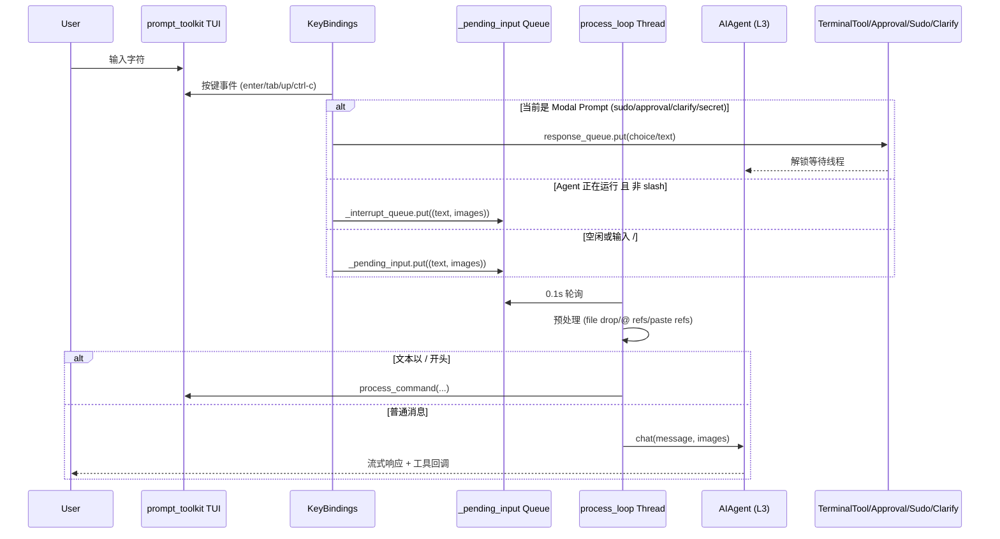
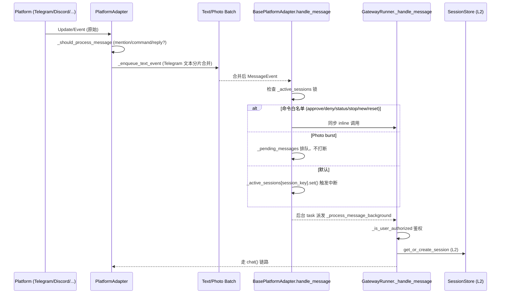

# L1 用户输入层（User Input Layer）

## 1. 业务背景

### 1.1 解决的问题

Hermes Agent 同时面向两种使用形态：本地交互式 CLI（终端 prompt_toolkit TUI）与远程消息平台（Telegram/Discord/Slack/WhatsApp/Signal/Email/SMS/Mattermost/Matrix/钉钉/飞书/企业微信/BlueBubbles/HomeAssistant/Webhook）。L1 的核心职责是把 **异构通道的用户输入** 统一归一化成可路由的事件，再投递到 L2 会话解析层与 L3 Agent 执行层。如果缺少这一层，每个平台都要在业务侧重复实现「鉴权 → 命令拦截 → 文本/媒体批处理 → 中断合并 → 排队」的链路，既无法横向扩展平台，也无法在 TUI 端复用同一份语义。

### 1.2 在对话流中的位置

L1 是整条流水线的入口，所有 User 原始输入必经它。L1 之下不再有用户来源区分，L1 之上则全部抽象为 `MessageEvent`（CLI）或 `tuple[str, list[Path]]`（TUI payload）。后继的 L2（会话解析）只关心 `source.platform / user_id / chat_id` 三个字段。

### 1.3 用户行为

- TUI：键入字符 → Enter 提交；可粘贴图片、拖拽文件、@ 引用、唤起补全（Tab）、历史回溯（↑/↓）、Ctrl+C 中断、Slash 命令（/help、/new、/resume、/title 等 30+ 条）。Agent 运行中再敲字则进入中断队列或下一轮排队（取决于 `busy_input_mode`）。
- Gateway：发送任意文本/图片/语音/位置/文档；机器人会做平台特定的合并（Telegram 文本合并、photo burst 批处理、命令白名单过滤），再发到统一的 `handle_message`。

## 2. 业务流程

### 2.1 时序图（CLI 主路径）



### 2.2 时序图（Gateway 主路径）



### 2.3 关键决策点

| 决策点 | 触发位置 | 行为 |
|---|---|---|
| Modal 优先 | `cli.py:7241-7286` | sudo/secret/approval/clarify 命中时把输入送往对应 response_queue，不入 pending |
| Slash 命令 | `cli.py:7298` | `_looks_like_slash_command` 决定是否走 `process_command` |
| Agent 运行中 | `cli.py:7298-7314` | `busy_input_mode="queue"` → pending；否则 → interrupt_queue |
| 文件拖放 | `cli.py:8335-8348` | `_detect_file_drop` 解析拖入路径，image 直接进 submit_images |
| @ 上下文引用 | `cli.py:6514-6533` | 文本中 `@file:` / `@diff` 由 `agent.context_references` 展开 |
| 配对码策略 | `gateway/run.py:1802-1831` | DM + `pair` 行为 → 发放配对码（带速率限制） |
| 命令白名单 | `gateway/platforms/base.py:1173` | approve/deny/status/stop/new/reset 直通，绕开会话锁 |
| Photo burst | `gateway/platforms/base.py:1195-1205` | 同一 media_group 或短时间多次 photo 合并，不打断运行 |
| 过期 session | `gateway/run.py:1876-1917` | 30 分钟空闲 + 10×/2h 墙钟阈值 → 驱逐悬空 sentinel |

### 2.4 错误处理

- **Modal 超时**：clarify/approval/sudo/secret 均在 `cli.py:6268-6304` 用 `_approval_deadline`（60s）等待；超时统一返回 "deny"（approval）、空字符串（sudo/secret）或 `Empty`。
- **配对码生成失败**：`gateway/run.py:1822-1831` 触发速率限制，避免轰炸用户。
- **更新响应文件写入失败**：`gateway/run.py:1856-1858` 捕获 `OSError`，返回错误提示。
- **Stale agent 驱逐**：`gateway/run.py:1903-1917` 用 sentinel 鉴别（`_AGENT_PENDING_SENTINEL`）避免误杀正在初始化的任务。
- **硬停止**：`_cmd_def_inner.name == "stop"` 时强制 `del self._running_agents[_quick_key]`，防止 executor 线程阻塞后无法解锁。

## 3. 技术架构

### 3.1 关键类/函数

| 组件 | 路径:行 | 职责 |
|---|---|---|
| `HermesCLI` | `cli.py:1307` | TUI 主类，承载 `_pending_input` / `_interrupt_queue` |
| `HermesCLI.run` | `cli.py:7104` | 构建 prompt_toolkit `Application`、状态变量、KeyBindings |
| `HermesCLI.process_command` | `cli.py:4425` | 30+ slash 命令分发，通过 `hermes_cli.commands.resolve_command` 解析别名 |
| `HermesCLI._approval_callback` | `cli.py:6251` | 危险命令确认（once/session/always/deny） |
| `HermesCLI._sudo_password_callback` | `cli.py:6245` 区域 | sudo 密码输入（`timeout=60`） |
| `HermesCLI._secret_capture_callback` | `cli.py:6416` | 技能 setup 时的密钥捕获 |
| `HermesCLI.chat` | `cli.py:6464` | 装配 agent、流式 TTS、@ 引用展开、图像视觉预处理 |
| `process_loop` | `cli.py:8294` | 后台线程 0.1s 轮询 `_pending_input` |
| `BasePlatformAdapter` | `gateway/platforms/base.py:475` | 所有平台适配器抽象基类 |
| `BasePlatformAdapter.handle_message` | `gateway/platforms/base.py:1143` | 会话锁管理、命令白名单、photo 批处理 |
| `TelegramAdapter._handle_text_message` | `gateway/platforms/telegram.py:2068` | 文本入口（带 `media_group_id` 合并） |
| `TelegramAdapter._enqueue_text_event` | `gateway/platforms/telegram.py:2144` | 短时间窗口内合并 Telegram 文本分片 |
| `GatewayRunner` | `gateway/run.py:463` | 全平台事件总控 |
| `GatewayRunner._is_user_authorized` | `gateway/run.py:1670` | 多策略鉴权（env 列表、pairing、allow-all、WhatsApp 别名展开） |
| `GatewayRunner._handle_message` | `gateway/run.py:1780` | 消息主处理：鉴权 → update 响应 → 状态检查 → 派发 |
| `GatewayRunner._handle_message_with_agent` | `gateway/run.py:2318` | 实际 session 创建 + 上下文构建 + agent 派发 |

### 3.2 设计模式

- **Template Method**：`BasePlatformAdapter` 把 connect/dispatch/send 抽象为 `abstractmethod`，子类实现平台 SDK 调用。
- **Strategy / 注册表**：CLI 命令通过 `hermes_cli/commands.py` 的 `CommandDef` 注册中心 + `resolve_command` 解析别名，新增命令只改一处。
- **Producer-Consumer（Queue）**：CLI 用 `_pending_input` / `_interrupt_queue` 两条 `queue.Queue` 把 UI 线程和 agent 线程解耦。
- **State Machine**：TUI 维护 `_clarify_state / _sudo_state / _approval_state / _secret_state / _clarify_freetext` 等互斥状态机，键绑定按状态分流。
- **Adapter / Anti-corruption Layer**：所有平台输入必须先转成 `MessageEvent(source=SessionSource, text=..., media_urls=..., message_type=MessageType.*)`，把外部协议与领域模型隔开。
- **Token Bucket / 速率限制**：配对码生成使用 `pairing_store._is_rate_limited` 防止刷码。
- **Sentinel Pattern**：`_AGENT_PENDING_SENTINEL` 标记「正在初始化的 agent」，避免并发消息误判空闲。

### 3.3 依赖图

```
                ┌────────────────────────────────────────┐
                │            User (Human)                 │
                └──────────┬──────────────────┬────────────┘
                           │                  │
              prompt_toolkit TUI        13 个 Platform SDKs
                           │                  │
                  HermesCLI.run()    PlatformAdapter.handle_message
                           │                  │
            _pending_input / _interrupt   session_key lock + batch
                           │                  │
                           └────────┬─────────┘
                                    ▼
                       GatewayRunner._handle_message
                                    ▼
                       (L2) SessionStore.get_or_create_session
                                    ▼
                       (L3) AIAgent.chat / run_agent.AIAgent
```

## 4. 核心实现细节

### 4.1 TUI 键绑定路由（cli.py:7224-7400）

`KeyBindings` 注册了 9 组绑定：`enter` / `escape,enter` / `c-j` / `tab` / `up&down` × 3（clarify/approval/history） / `c-c`。`enter` 处理器是核心调度，按状态依次短路：
1. sudo_state → `response_queue.put(password)`，清空状态。
2. secret_state → `_submit_secret_response`。
3. approval_state → `_handle_approval_selection`（含 `view` 展开）。
4. clarify_freetext → freetext 文本入队。
5. clarify_state → 选中项入队，"Other" 切到 freetext。
6. 正常模式：根据 `_agent_running` 选 `_interrupt_queue` 或 `_pending_input`，slash 命令永远走 pending。

### 4.2 双队列解耦（cli.py:7147-7148）

`_pending_input` 由 `process_loop` 消费（0.1s 轮询，`queue.Empty` 继续）；`_interrupt_queue` 由 `chat()` 内部协程监控，触发 `agent.interrupt()`。分离目的是避免 `process_loop` 的 `get(timeout=0.1)` 与中断监控的 `get_nowait()` 互相争抢、出现 `Empty` 处理不一致。

### 4.3 Slash 命令解析（cli.py:4441-4444）

```python
_base_word = cmd_lower.split()[0].lstrip("/")
_cmd_def = _resolve_cmd(_base_word)
canonical = _cmd_def.name if _cmd_def else _base_word
```

支持 `/q` → `quit`、`/h` → `help` 等别名，新增别名只需在 `commands.py` 注册表中追加 `aliases=[]`。`_looks_like_slash_command` 仅在 `chat()` 之外、submit 之后判断，避免把 `/_internal` 误送进 chat。

### 4.4 危险命令批准工作流（cli.py:6251-6311）

1. `terminal_tool` 调用 `set_approval_callback` 注册的回调（cli.py:7205）。
2. CLI 在 `_approval_lock` 串行化（cli.py:6268）后填入 `_approval_state`，启动 60s 倒计时。
3. UI 渲染 `_get_approval_display_fragments`（cli.py:6337）画一个面板，含 once/session/always/deny/view。
4. 用户按 Enter → `_handle_approval_selection`（cli.py:6313）走 choice → `response_queue.put(chosen)`。
5. `terminal_tool` 阻塞线程被唤醒，按选择放行（once=本次、session=本次 session、always=持久化到 allowlist）。

### 4.5 Gateway 鉴权链（gateway/run.py:1670-1771）

1. `HOMEASSISTANT` / `WEBHOOK` → 系统内部，直接通过。
2. 每平台 `*_ALLOW_ALL_USERS` env 命中 → 通过。
3. `pairing_store.is_approved(platform, user_id)` → 通过。
4. 平台 env（`TELEGRAM_ALLOWED_USERS` 等）+ `GATEWAY_ALLOWED_USERS` 集合匹配；支持 `"*"`。
5. WhatsApp 特殊：`_expand_whatsapp_auth_aliases` 把 phone↔LID 互转。
6. 未通过 → DM 发配对码（速率限制）/ 群组静默忽略。

### 4.6 平台批处理

- **Telegram 文本合并**（telegram.py:2144-2171）：Telegram 客户端会把长文本切成多个 update；同 session_key 在 `_text_batch_delay_seconds`（默认几百 ms）内累积到 `_pending_text_batches`，每次新事件 cancel 旧 timer。
- **Photo burst**（base.py:1195-1205）：连续 `MessageType.PHOTO` 通过 `existing.media_urls.extend(...)` 累积；进入 `handle_message` 时已合并，避免重复打断。
- **Album 合并**（telegram.py:2194-2205）：以 `media_group_id` 为 key 区分，单独 flush。

### 4.7 会话锁与中断合并（base.py:1143-1230）

`_active_sessions[session_key] = asyncio.Event()` 在 spawn 任务**之前**同步设置（base.py:1219），关闭「双消息竞争同时进 task」的窗口。新消息到达时：
- 命令白名单 → inline 调用 handler；
- photo burst → 排队不打断；
- 普通文本 → `self._active_sessions[session_key].set()` 唤醒当前任务执行清理 + 处理 pending。

## 5. 跨层交互

### 5.1 与 L2（会话解析层）的契约

- CLI：`chat(message, images)` 直接调用 `AIAgent.__init__` / `AIAgent.run_conversation`，session 由 `HermesCLI.session_id`（已绑定 `_session_db`）隐式提供。
- Gateway：`GatewayRunner._handle_message` 之后会调 `self.session_store.get_or_create_session(source)`，输入只需保证 `source.platform / user_id / chat_id` 三元组存在。
- 契约对象：`SessionSource`（含 `platform: Platform`、`user_id`、`user_name`、`chat_id`、`chat_type`、`thread_id`）和 `MessageEvent`（含 `text`、`media_urls`、`media_types`、`message_type: MessageType`、`source`、`command`）。

### 5.2 与 L3（Agent 执行层）的契约

- CLI：`self.agent` 必须实现 `interrupt()` / `run_conversation(message, images)` / 上下文压缩（`context_compressor`）。
- Gateway：`session_entry` 传入后，由 `build_session_context` → `build_session_context_prompt` 组装上下文再送进 `AIAgent`，事件回调路径为 `_handle_message_with_agent → _run_agent → chat`。

### 5.3 事件流

- TUI：键事件 → 队列 → `process_loop` → `chat()`。
- Gateway：平台 update → adapter → `BasePlatformAdapter.handle_message` → `GatewayRunner._handle_message` → session 创建 → agent 派发。
- 内部事件（`event.internal=True`）跳过鉴权，常见来源：后台进程完成通知、cron 触发、update 提示响应。

## 6. 异常处理

### 6.1 失败模式

| 失败 | 位置 | 兜底 |
|---|---|---|
| 配对码生成冲突 | `gateway/run.py:1809-1821` | 速率限制 + 友好文案 |
| 用户未授权 | `gateway/run.py:1799-1832` | DM 发配对码、群组静默 |
| Pending 消息损坏 | `gateway/platforms/base.py:1224-1228` | try/except 跳过 background task 注册 |
| Modal 超时 | `cli.py:6293,6248,6303` | 60s 后默认 deny / 跳过 |
| Agent 死锁（executor 阻塞） | `gateway/run.py:1934-1946` | `/stop` 强制清理 `_running_agents` |
| Stale sentinel | `gateway/run.py:1903-1917` | 30 min 空闲 + 10×/2h 墙钟驱逐 |
| 运行时凭据失效 | `cli.py:6488-6489` | `_ensure_runtime_credentials` 失败 → 返回 None |
| @ 引用解析异常 | `cli.py:6532-6533` | logging.debug 静默继续 |
| 粘贴引用文件不存在 | `cli.py:8366` | 保留原始占位符不抛错 |
| TTS 导入失败 | `cli.py:6585-6588` | 退回到普通流式 |
| Vision 预处理失败 | `cli.py:6509-6511` | 静默使用原 message |

### 6.2 用户可见错误

- "⏱ Timeout — denying command"：approval 超时。
- "⏱ Timeout — continuing without sudo"：sudo 等待超时。
- "Hi~ I don't recognize you yet!"：未授权 DM。
- "Too many pairing requests right now~"：配对码速率限制。
- "Sent to the update process" / "Failed to send response to update process"：/update 流程的回复回写。
- "⚡ Interrupting agent... (press Ctrl+C again to force exit)"：连续两次 Ctrl+C 强制退出。

## 7. 性能与安全

### 7.1 性能特征

- TUI 轮询间隔 0.1s（`cli.py:8299`），单核开销可忽略。
- 中断检测使用独立 `_interrupt_queue`，避免与主轮询争抢 `Lock`。
- Telegram 文本合并窗口 `_text_batch_delay_seconds`（默认约 500ms），photo burst `_media_batch_delay_seconds` 同样量级；用户敲长文不会触发频繁 dispatch。
- 配对码速率限制避免暴力刷码轰炸消息通道。
- `_check_config_mcp_changes` 只在 idle 周期触发，避免热路径卡 IO。

### 7.2 缓存

- 无显式缓存层。session 复用由 L2 `SessionStore` 负责；`HERMES_HOME` 通过 `get_hermes_home()` 单例解析。
- 平台 adapter 状态（`_active_sessions` / `_pending_messages` / `_pending_text_batches`）是短生命周期内存态，重启清空。

### 7.3 安全考虑

- **鉴权优先级**：`allow_all env` > `pairing store` > `allowlist env` > `*` 通配；`HOMEASSISTANT/WEBHOOK` 走 HMAC 而非 allowlist，避免系统事件被外部用户触发。
- **配对码机制**：陌生用户 DM 不直接拒绝，而是发一次性配对码 + 命令 `hermes pairing approve <platform> <code>`，由 owner 显式授权。
- **WhatsApp 别名**：`phone↔LID` 双向展开，避免 bridge 端用 LID 替换后失去授权。
- **审批门**：危险命令（终端工具）必须经 `_approval_callback` 显式放行，支持 once / session / always / deny。
- **sudo 密码**：`timeout=60s` 自动跳过；输入 buffer 在弹窗时通过 `_capture_modal_input_snapshot` 暂存，关闭时 `_restore_modal_input_snapshot` 还原，避免泄漏。
- **TTS/语音/图片** 全部走与文本相同的鉴权链路，无旁路。
- **写入更新响应**（gateway/run.py:1851-1858）使用 `tmp.replace()` 原子替换，防止半写文件。
- **配置热重载** 仅在 idle 检查，避免运行中变更打断 agent；变更时只对 `mcp_servers` 子树生效（其他变更需重启，符合 prompt caching 不破原则）。

## 8. 关键洞察

### 8.1 最重要的点

1. **L1 是「输入归一化」层，不是「业务执行」层**。所有平台差异（批处理、mention、命令）都在 L1 屏蔽，L2/L3 只看 `MessageEvent` 和 `SessionSource`。
2. **双队列 + Modal 状态机** 是 TUI 输入层的灵魂：`enter` 处理器的 5 个短路分支决定整条流水的并发安全性。
3. **Session 锁（`_active_sessions`）+ Sentinel（`_AGENT_PENDING_SENTINEL`）+ Stale 驱逐** 是 Gateway 高并发下避免「双重 agent」与「永久锁死」的三件套。

### 8.2 常见陷阱

- 在 `enter` 处理器里**忘记清空 `_pending_input`/`_interrupt_queue`**：会导致同一条消息被消费两次。
- 在 `handle_message` 中**先 spawn task 再设 `_active_sessions`**：会复现 race window（base.py:1219 注释明确警告）。
- 在 modal 状态下仍走 `process_command`：slash 命令会绕过 `enter` 的 sudo/clarify 分支，导致状态泄漏。
- Gateway 鉴权时**忘了把 `*` 加入 set**：会用字符串 `"*"` 去匹配 user_id，结果永远 False。
- 在 `_handle_message` 中**不处理 `event.internal`**：后台进程通知会被当作用户输入而触发鉴权失败。

### 8.3 阅读顺序

1. `cli.py:1307` → `HermesCLI` 类签名 + 关键状态变量。
2. `cli.py:7104-7224` → `run()` 方法中 TUI 装配 + KeyBindings 注册。
3. `cli.py:7226-7400` → `enter`/`tab`/`up/down`/`c-c` 键绑定实现。
4. `cli.py:4425-4600` → `process_command` 命令分发。
5. `cli.py:8294-8440` → `process_loop` 队列消费与图像/paste/file drop 预处理。
6. `gateway/platforms/base.py:475-1230` → `BasePlatformAdapter` 抽象 + `handle_message` 锁/批处理/命令白名单。
7. `gateway/platforms/telegram.py:2068-2219` → 文本合并与 photo 批处理参考实现。
8. `gateway/run.py:1670-1771` → 鉴权链。
9. `gateway/run.py:1780-2050` → 鉴权后 → update 响应 → 状态检查 → 命令派发。
10. `gateway/run.py:2318-2400` → 真实 agent 派发前奏（session 创建、上下文装配）。
