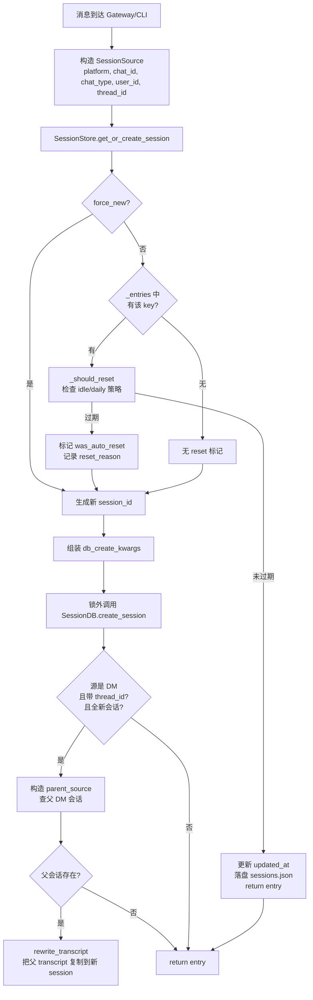
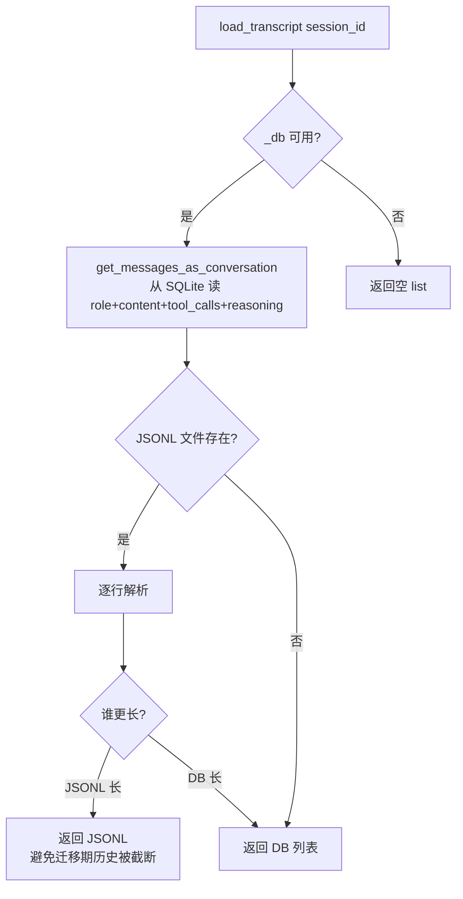
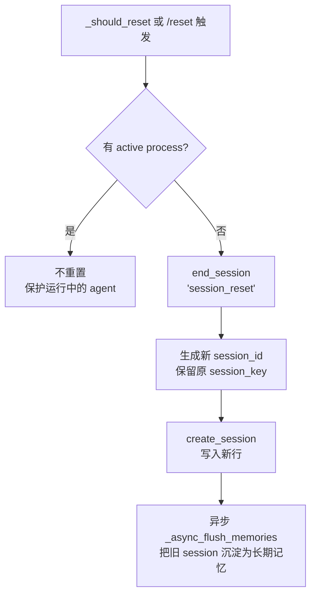
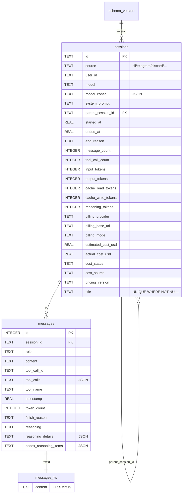
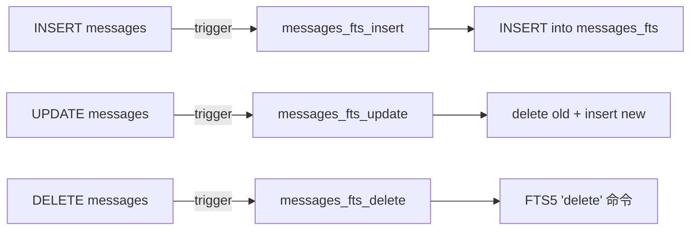

# L2 会话解析层（Session Resolution Layer）

> 解析消息来源、生成会话键、决定会话生命周期，并提供统一的 SQLite/JSONL 持久化能力。
> 本层向上层（L3 消息路由、L4 Agent Loop）屏蔽了"消息来自谁、归到哪个会话、什么时候该清空"的复杂性。

---

## 1. 业务背景

Hermes Agent 同时承载**多种入口**的消息：CLI 本地终端、Gateway（多平台适配器：Telegram/Discord/Slack/WhatsApp/Signal/BlueBubbles），以及 worktree/子代理。不同入口需要：

| 业务诉求 | 解决方案 |
|---|---|
| **同一 DM 用户必须看到连续上下文** | `build_session_key()` 把 `(platform, chat_id[, thread_id])` 编码为确定性 key |
| **群组中多人隔离** | `group_sessions_per_user=True` 时把 `user_id` 拼到 key 末端 |
| **Forum 主题/线程共享上下文** | `thread_sessions_per_user=False`（默认）—— thread 内所有用户共享同一 session |
| **会话过大要清空** | `_should_reset()` 评估 idle/daily 策略 |
| **跨进程可搜索** | `SessionDB` 用 SQLite + FTS5 取代散落的 JSONL |
| **保证单写多读、不丢消息** | WAL + 应用层 jitter 重试 + 周期性 PASSIVE checkpoint |
| **历史压缩后还能引用旧消息** | `parent_session_id` 外键 + 子会话链表 |
| **PII 保护** | 哈希 + 平台白名单脱敏，避免把明文 ID 发给 LLM |

> 关键文件：
> - `D:/DevSpace/person/ai_space/hermes-agent/gateway/session.py` —— `SessionStore` / `SessionSource` / `SessionContext` / `build_session_key()`
> - `D:/DevSpace/person/ai_space/hermes-agent/hermes_state.py` —— `SessionDB`（SQLite + FTS5）
> - `D:/DevSpace/person/ai_space/hermes-agent/cli.py:1514` —— CLI 端直接复用 `SessionDB`

---

## 2. 业务流程

### 2.1 主链路：消息进入 → 解析会话 → 返回 entry



### 2.2 入库链路：每轮 LLM 交互的 transcript 写入

```mermaid
flowchart LR
    X[Agent Loop 完成一次响应] --> Y{agent 是否已<br/>自己 flush?}
    Y -- 是 --> Z[skip_db=True<br/>只写 JSONL]
    Y -- 否 --> AA[SessionStore.append_to_transcript]
    AA --> AB[SessionDB.append_message<br/>同事务内 message_count+1]
    AA --> AC[写 sessions/{id}.jsonl]
    AB --> AD[FTS5 trigger 自动同步<br/>messages_fts 索引]
    AC --> AE[落盘完成]
```

### 2.3 加载链路：Agent 启动 / 续接 / `/resume` 时



### 2.4 重置链路：idle / daily 触发 / `/reset` 命令



---

## 3. 技术架构

### 3.1 关键类/函数表

| 名称 | 文件:行 | 职责 |
|---|---|---|
| `SessionDB` | `hermes_state.py:115` | SQLite 持久化层（schema/迁移/FTS5/搜索） |
| `SessionDB._execute_write` | `hermes_state.py:164` | 写入统一入口：BEGIN IMMEDIATE + jitter 重试 |
| `SessionDB._init_schema` | `hermes_state.py:252` | 创建表 + 6 个版本迁移 |
| `SessionDB.sanitize_title` | `hermes_state.py:629` | 标题清洗（控制字符/双向控制符/空白合并） |
| `SessionDB._sanitize_fts5_query` | `hermes_state.py:1000` | FTS5 MATCH 查询净化 |
| `SessionSource` | `gateway/session.py:74` | 描述消息来源（不可变 dataclass） |
| `SessionContext` | `gateway/session.py:159` | 注入到 system prompt 的运行时上下文 |
| `SessionEntry` | `gateway/session.py:345` | `session_key → session_id` 的内存映射 |
| `build_session_key` | `gateway/session.py:445` | 会话键生成的**唯一权威函数** |
| `SessionStore` | `gateway/session.py:504` | 会话生命周期管理（含 JSONL/SQLite 双写） |
| `SessionStore.get_or_create_session` | `gateway/session.py:693` | 核心入口 |
| `SessionStore._should_reset` | `gateway/session.py:627` | idle/daily 策略评估 |
| `SessionStore.load_transcript` | `gateway/session.py:1003` | JSONL/SQLite 择优加载 |
| `build_session_context_prompt` | `gateway/session.py:203` | 把上下文渲染成可注入的 markdown |

### 3.2 6 种设计模式

| 模式 | 体现 | 位置 |
|---|---|---|
| **Repository** | `SessionDB` 封装对 SQLite 的所有访问 | `hermes_state.py` 全文 |
| **Strategy** | `SessionResetPolicy` 字段 `mode`（`none/idle/daily/both`）决定重置算法 | `gateway/config.py:98` + `gateway/session.py:610-625` |
| **Facade** | `SessionStore` 对外屏蔽 SQLite/JSONL/索引三套存储 | `gateway/session.py:504` |
| **Single Source of Truth** | `build_session_key` 是会话键生成的唯一权威函数 | `gateway/session.py:445` |
| **Template Method** | `_execute_write(fn)` 让所有写操作共享"加锁→BEGIN→提交→checkpoint"骨架 | `hermes_state.py:164-214` |
| **Null Object（退化对象）** | 当 SQLite 不可用时，`self._db=None`，所有 DB 操作 try/except 退化为纯 JSONL 写入 | `gateway/session.py:524-528` |

---

## 4. 核心实现细节

### 4.1 SQLite Schema



关键约束：

- **唯一 title 索引**：`CREATE UNIQUE INDEX ... ON sessions(title) WHERE title IS NOT NULL`（`hermes_state.py:337-339`）—— 允许多个 NULL，但非空必须唯一。
- **WAL 模式**：`PRAGMA journal_mode=WAL`（`hermes_state.py:157`）—— 允许多读单写并发。
- **外键**：`PRAGMA foreign_keys=ON`（`hermes_state.py:158`），但 `delete_session` 采用**孤儿化**而非级联删除以保留可访问性（`hermes_state.py:1250-1257`）。

### 4.2 6 步版本迁移

`hermes_state.py:264-331` 实现了从 v1 → v6 的就地升级：

| 版本 | 变更 | 文件:行 |
|---|---|---|
| v1 → v2 | `messages.finish_reason` 列 | `hermes_state.py:265-271` |
| v2 → v3 | `sessions.title` 列 | `hermes_state.py:272-278` |
| v3 → v4 | `title` 唯一索引（条件） | `hermes_state.py:279-288` |
| v4 → v5 | 11 个计费/token 字段 | `hermes_state.py:289-312` |
| v5 → v6 | `reasoning` / `reasoning_details` / `codex_reasoning_items` 三列（v6 解决多轮推理链断裂） | `hermes_state.py:313-331` |

迁移采用 `try/except sqlite3.OperationalError` 兜底（列已存在则跳过），**幂等可重入**。

### 4.3 FTS5 全文搜索



- `messages_fts` 是 **contentless** 虚表（`hermes_state.py:93-98`），使用 `content=messages, content_rowid=id` 引用主表，避免数据重复。
- 三个 trigger（`hermes_state.py:100-111`）保证 `messages` 表写入/更新/删除时 FTS 索引同步。
- `_sanitize_fts5_query`（`hermes_state.py:1000-1050`）做了 6 步处理：保留合法引号短语、剥离特殊字符、压缩 `*`、去除悬挂布尔运算、把 `chat-send` / `P2.2` 这类带 `-`/`.` 的 token 包装成短语以防止被分词器拆开。

### 4.4 并发控制

> 多 hermes 进程（gateway + CLI + worktree agent）共用同一个 `state.db`，WAL 写锁争用会引发 TUI 冻结。

策略：

| 措施 | 实现 | 目的 |
|---|---|---|
| `timeout=1.0` | `hermes_state.py:150` | 短超时 + 应用层重试替代 SQLite 内置 30s busy handler |
| `_WRITE_MAX_RETRIES=15` | `hermes_state.py:132` | 最多 15 次 |
| `_WRITE_RETRY_MIN_S=0.020 / _WRITE_RETRY_MAX_S=0.150` | `hermes_state.py:133-134` | 20-150ms **随机 jitter**，打破 SQLite 确定性退避的 convoy |
| `BEGIN IMMEDIATE` | `hermes_state.py:183` | 事务开始时立即抢 WAL 写锁（而非 commit 时） |
| `_CHECKPOINT_EVERY_N_WRITES=50` | `hermes_state.py:136` | 每 50 次成功写后做一次 PASSIVE checkpoint |
| Python 锁 (`_lock`) | `hermes_state.py:142` | 串行化多线程对单一连接的访问 |
| `check_same_thread=False` | `hermes_state.py:148` | 允许多线程共享连接（但仍由 `_lock` 保护） |

### 4.5 JSONL 降级存储

`SessionStore.append_to_transcript`（`gateway/session.py:943-969`）采用**双写策略**：

```
SQLite (主)  +  sessions/{session_id}.jsonl (兼容)
```

- **何时跳过 SQLite**：`skip_db=True`，用于 agent 自身已通过 `_flush_messages_to_session_db` 写入的场景，防止 #860 的重复写入。
- **何时 JSONL 占优**：`load_transcript`（`gateway/session.py:1003-1049`）对比 `len(jsonl) > len(db)`，**取较长者**——这是为了解决"迁移期内，新 session 的第一次写入只看到少量 DB 行而忽略完整 JSONL 历史"的截断 bug。
- **降级到 JSONL**：`SessionStore.__init__` 中 `from hermes_state import SessionDB` 失败时（`gateway/session.py:524-528`），整个 DB 字段为 None，所有 DB 调用都进入 `except` 退回纯 JSONL 模式。

### 4.6 会话键生成规则

`build_session_key(source, group_sessions_per_user, thread_sessions_per_user)`（`gateway/session.py:445-501`）的**真值表**：

| chat_type | chat_id | thread_id | 隔离策略 | 输出 key 模式 |
|---|---|---|---|---|
| `dm` | 有 | 无 | — | `agent:main:<platform>:dm:<chat_id>` |
| `dm` | 有 | 有 | — | `agent:main:<platform>:dm:<chat_id>:<thread_id>` |
| `dm` | 无 | 有 | — | `agent:main:<platform>:dm:<thread_id>` |
| `dm` | 无 | 无 | — | `agent:main:<platform>:dm` |
| `group/channel` | 有 | 无 | 共享 | `agent:main:<platform>:group:<chat_id>` |
| `group/channel` | 有 | 无 | 隔离 | `agent:main:<platform>:group:<chat_id>:<user_id[_alt]>` |
| `group/channel` | 有 | 有 | 共享（默认） | `agent:main:<platform>:group:<chat_id>:<thread_id>` |
| `group/channel` | 有 | 有 | 隔离 | `agent:main:<platform>:group:<chat_id>:<thread_id>:<user_id[_alt]>` |
| `group/channel` | 无 | 无 | — | `agent:main:<platform>:group` |

> **关键设计**：`thread_sessions_per_user=False`（默认）使论坛主题/线程内**全员共享同一会话**——这是 Telegram 主题/Discord 线程的预期 UX（所有参与者看到同一上下文）。Slack 线程中，当 bot 回复创建了 thread 而用户在该 thread 内回复时，会**触发 DM thread 种子化**——把父 DM 的 transcript 复制到新 session（`gateway/session.py:780-806`）。
>
> **participant_id 优先级**：`user_id_alt` 优先于 `user_id`（`gateway/session.py:483`），用于 Signal UUID vs phone 号码的双 ID 场景。

### 4.7 PII 脱敏

`build_session_context_prompt`（`gateway/session.py:203-341`）的脱敏路径：

| 步骤 | 实现 | 文件:行 |
|---|---|---|
| 白名单平台 | `frozenset({WHATSAPP, SIGNAL, TELEGRAM, BLUEBUBBLES})` | `gateway/session.py:192-200` |
| Sender 哈希 | `user_<sha256[:12]>` | `gateway/session.py:43-45` |
| Chat ID 哈希 | 保留 `platform:` 前缀，仅哈希数字段 | `gateway/session.py:48-58` |
| 路由仍用原值 | `SessionSource` 内的原值未变，**只渲染时被替换** | `gateway/session.py:218-220` |
| Discord 排除 | mentions 使用 `<@user_id>` 语法，LLM 需要真实 ID | `gateway/session.py:200` |

### 4.8 会话过期与自动重置

- **idle 模式**：`now > updated_at + idle_minutes` 触发（`gateway/session.py:610-613`），默认 1440 分钟。
- **daily 模式**：跨过 `at_hour`（默认 4 点）即重置（`gateway/session.py:615-623`）。
- **both 模式**：任一条件满足即重置。
- **保护机制**：有活跃后台进程的 session **永不被重置**（`gateway/session.py:596-598, 636-639`）。
- **重置副作用**：旧 session 被 `end_session("session_reset")` 标记，**异步**触发 `_async_flush_memories` 把对话沉淀为长期记忆（`gateway/run.py:3268-3274`）。
- **重置通知**：`was_auto_reset` / `auto_reset_reason` / `reset_had_activity` 三个字段一次性传递给消息处理器（`gateway/session.py:377-380`），用于在下一轮注入"会话已重置"的提示。

---

## 5. 跨层交互

### 5.1 与 L1（配置/平台）契约

| 契约 | 方向 | 位置 |
|---|---|---|
| `group_sessions_per_user: bool` | L1 → L2 | `gateway/config.py:249` |
| `thread_sessions_per_user: bool` | L1 → L2 | `gateway/config.py:250` |
| `SessionResetPolicy.mode/idle_minutes/at_hour` | L1 → L2 | `gateway/config.py:98-110` |
| `SESSION_IDLE_MINUTES` / `SESSION_RESET_HOUR` 环境变量 | env → L1 → L2 | `gateway/config.py:979-989` |
| `has_active_processes_fn` 回调 | L1 → L2 | `gateway/session.py:512-520`（`process_registry` 注入） |

### 5.2 与 L3（消息路由）契约

| 契约 | 调用方 | 位置 |
|---|---|---|
| `get_or_create_session(source) -> SessionEntry` | `_handle_message` / `/status` / `/retry` / `/undo` / `/compress` / `/title` / `/btw` | `gateway/run.py:2330, 3383, 3964, 3999, 4995, 5064, 4750` |
| `load_transcript(session_id) -> List[msg]` | 所有需要历史的地方 | `gateway/run.py:653, 2456, 3965, 4000, 4751, 4996` |
| `append_to_transcript(session_id, msg, skip_db)` | Agent Loop 完成时 | `gateway/run.py:3046, 3067, 3072, 3088` |
| `rewrite_transcript(session_id, msgs)` | `/retry` / `/undo` / `/compress` / 自动压缩 | `gateway/run.py:3981, 4014, 5045, 2661` |
| `reset_session(session_key)` | `/reset` 命令 | `gateway/run.py:3295` |
| `switch_session(session_key, target_id)` | `/resume` 命令 | `gateway/session.py:877` |
| `update_session(session_key, last_prompt_tokens)` | 每轮交互后 | `gateway/run.py:3096, 5047` |
| `has_any_sessions()` | 首条消息判断 | `gateway/run.py:2692` |

### 5.3 跨进程一致性

| 场景 | 风险 | 缓解 |
|---|---|---|
| 多进程写同一 `state.db` | WAL 写锁争用 | 应用层 jitter 重试（4.4 节） |
| Gateway 进程崩溃 + CLI 进程同时操作 | 中间状态 | SQLite 事务原子性 + sessions.json 持久化（`gateway/session.py:558-579`）用临时文件 + `os.replace` 原子替换 |
| 进程间 `memory_flushed` 标志丢失 | 重复 flush | 持久化到 `sessions.json`（`gateway/session.py:386, 405`） |
| 进程间 `last_prompt_tokens` 不一致 | 压缩触发抖动 | 每轮都通过 `update_session` 写盘（`gateway/run.py:3096`） |

### 5.4 与 CLI 的复用关系

`cli.py:1514` 直接 `from hermes_state import SessionDB; self._session_db = SessionDB()`，CLI 端**绕过** `SessionStore`，只使用 `SessionDB` 做持久化和搜索。会话键生成、JSONL fallback、reset 策略这些 Gateway 特有的逻辑在 CLI 路径上不存在——CLI 是**单用户单会话**模型。

---

## 6. 异常处理

| 场景 | 触发条件 | 当前策略 | 位置 |
|---|---|---|---|
| `database is locked` | 多进程写冲突 | 释放锁 → 20-150ms 随机 jitter → 重试（最多 15 次） | `hermes_state.py:198-208` |
| FTS5 语法错误 | 用户输入含非法 token | 返回 `[]`，不抛异常 | `hermes_state.py:1125-1127` |
| 列已存在（迁移） | 旧版本数据库 | `try/except OperationalError` 跳过 | `hermes_state.py:269-270, 277, 286-287, 310, 329` |
| 标题超长 / 含控制符 | 用户调用 `/title` | `sanitize_title` 清洗或抛 `ValueError` | `hermes_state.py:629-668` |
| 标题冲突 | 另一 session 已用同标题 | 抛 `ValueError` | `hermes_state.py:686-692` |
| WAL checkpoint 失败 | 磁盘满 / 权限 | 静默 best-effort，永不致命 | `hermes_state.py:234-235, 247-248` |
| `SessionDB` 整体不可用 | 导入失败 / 初始化异常 | `self._db = None`，所有 DB 调用 try/except 降级到 JSONL | `gateway/session.py:524-528, 962-964` |
| JSONL 解析失败 | 文件损坏行 | 跳过该行 + warning | `gateway/session.py:1024-1028` |
| `sessions.json` 加载失败 | 文件损坏 | warning + 从空集合启动 | `gateway/session.py:553-554` |
| 临时文件写入失败 | 磁盘满 | 删除临时文件 + 重新抛异常 | `gateway/session.py:574-579` |
| 父 DM transcript 种子化失败 | 父 session 不存在 / DB 错误 | 静默 log warning，新 session 仍可用 | `gateway/session.py:805-806` |
| 旧平台的 `platform` 字段 | 配置文件包含已废弃的 platform 值 | 跳过该 entry，继续加载其他 | `gateway/session.py:549-552` |

---

## 7. 性能与安全

### 7.1 性能

- **WAL + 单连接池**：避免每写一行的连接建立开销，瓶颈仅在 WAL 写锁。
- **写入批量化**：`append_message` 在单事务内完成"插入 messages + 更新 sessions 计数器"（`hermes_state.py:893-928`），无 round-trip。
- **列表查询零 N+1**：`list_sessions_rich` 用相关子查询一次拉 preview 和 last_active（`hermes_state.py:817-834`）。
- **PASSIVE checkpoint**：每 50 次写自动收尾（`hermes_state.py:194-196`），避免 WAL 无限增长。
- **FTS5 snippet**：`snippet(messages_fts, 0, '>>>', '<<<', '...', 40)` 直接在 DB 端生成上下文片段，减少 LLM 上下文 token。

### 7.2 安全

- **FTS5 查询净化**：6 步处理避免语法注入（`hermes_state.py:1000-1050`）。
- **标题清洗**：去除 ASCII 控制符、双向控制符、零宽字符，防止 prompt injection（`hermes_state.py:629-670`）。
- **PII 脱敏**：哈希 + 平台白名单（`gateway/session.py:192-200, 236-249`）。
- **LIKE 通配符转义**：`resolve_session_id` / `get_next_title_in_lineage` 显式转义 `%` `_` `\`（`hermes_state.py:609-614, 732, 763`）。
- **DDL 防注入**：迁移时的列名通过双引号包裹并把 `"` 转义为 `""`（`hermes_state.py:308-309, 325-326`）。
- **原子写入**：`sessions.json` 写入采用 `mkstemp + fsync + os.replace`（`gateway/session.py:565-573`）。

---

## 8. 关键洞察

1. **会话键是稳定身份的来源**：`build_session_key` 一旦定义，DM/Group/Thread 隔离就由"拼什么"决定，而不是"在哪里调用"。这是整个 L2 层最该被锁住的函数。
2. **应用层 jitter 比 SQLite busy handler 更好**：写锁争用场景下，确定性退避会让多个进程在同毫秒内同时醒来再次争用——20-150ms 的随机化可自然错峰（`hermes_state.py:130-134`）。
3. **JSONL 不是被替代，而是"长期兼容层"**：`load_transcript` 取较长者的逻辑是迁移期的临时方案，但**只要还有用户在跑旧版 CLI**，JSONL 就必须保留。
4. **PII 脱敏只看渲染，不动存储**：`SessionSource.user_id` 永远是原值——路由、cron 投递、cache key 都依赖原值；脱敏只发生在 `build_session_context_prompt` 把数据塞进 system prompt 那一刻。
5. **`thread_sessions_per_user` 的默认值是产品决策**：默认 False 让论坛/线程体验更接近"群聊"，但调用方必须明确知道这一点——`build_session_key` 的 docstring 把它列为 first-class 配置（`gateway/session.py:494-496`）。
6. **重置通知是一次性的**：`was_auto_reset` 在第一次 `get_or_create_session` 命中后即被消费（`gateway/session.py:725-732`），不会在每次轮询时重复注入——这避免了 prompt 缓存被反复打 bust。
7. **FTS5 触发器维护了"无重复数据"的整洁**：contentless FTS5 表 + 三个 trigger 让 `messages_fts` 始终与 `messages` 同步，不存在"全文索引 vs 主表内容漂移"问题。
8. **删除采用孤儿化而非级联**：`delete_session` 把子 session 的 `parent_session_id` 置 NULL 而非级联删除（`hermes_state.py:1250-1257`）——这是对"压缩产生的子链路"的保护，避免一次清理把整个对话史抹掉。
9. **`memory_flushed` 持久化是 restart 友好的设计**：在 `sessions.json` 而非内存 set 中记录（`gateway/session.py:386`），意味着 gateway 重启后不会对同一 session 重复调用昂贵的 memory flush。
10. **CLI 路径是 L2 的"裁剪版"**：`cli.py:1514` 只复用 `SessionDB`，跳过了 `SessionStore`/`build_session_key`/reset 策略——CLI 是单用户单线程单会话，多平台逻辑对它而言是冗余。这种"按需复用"是良好分层的体现。
