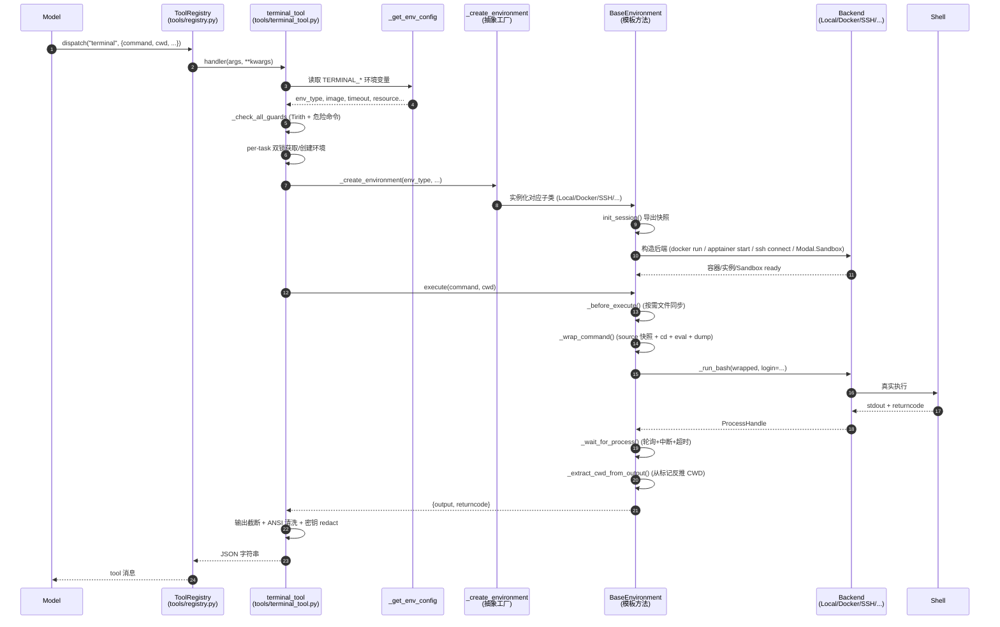

# L4 - 工具执行层（Tool Execution Layer）

> Hermes Agent 的「手脚」：把模型产出的 `tool_call` 安全、可控、可观察地落到本地或远程环境，并收集结果回灌给模型。

---

## 1. 业务背景

Hermes Agent 是一个多后端（multi-backend）的智能体框架。模型只负责"思考 + 输出结构化 `tool_call`"，真正的 I/O 全部委托给 L4 完成。L4 面临三组互相对立的约束：

1. **隔离性 vs 易用性**：Agent 需要在受控沙箱中执行任意 shell 命令（HPC、CI、危险副作用），又不能拖慢本地开发体验。
2. **跨平台一致性**：同一份 `terminal_tool` schema，对应 6 种底层后端（local / docker / singularity / ssh / modal / daytona），输出必须保持稳定，模型感知不到差异。
3. **会话连续性**：模型的多轮调用里要复用 CWD、环境变量、alias、shell 函数等"会话状态"，但每次 `tool_call` 在云端 SDK 上几乎都是新进程。

L4 用「**注册表（单例）+ 抽象工厂 + 模板方法 + 协议抽象 + 适配器 + 快照/恢复**」六种设计模式来统一处理这些问题。本层不关心 prompt 怎么解析，也不关心回复怎么渲染——只关注"在哪个环境、用什么进程模型、怎样把命令跑完、怎样把结果回写"。

---

## 2. 业务流程

### 2.1 端到端调用时序



### 2.2 6 种后端对比

| 维度 | Local | Docker | Singularity | SSH | Modal | Daytona |
|------|-------|--------|-------------|-----|-------|---------|
| 启动开销 | 0 | 中（首启拉镜像） | 中（首启拉 SIF） | 低（ControlMaster） | 高（云端冷启动） | 高（云端冷启动） |
| 进程模型 | 每次新进程 | 容器内新进程 | instance + exec | 每次新 ssh 会话 | Sandbox.exec | Sandbox.exec |
| 进程句柄 | `subprocess.Popen` | `subprocess.Popen` | `subprocess.Popen` | `subprocess.Popen` | `_ThreadedProcessHandle` | `_ThreadedProcessHandle` |
| stdin 通道 | `PIPE` + 线程写 | `PIPE` + 线程写 | `PIPE` + 线程写 | `PIPE` + 线程写 | **heredoc 嵌入** | **heredoc 嵌入** |
| CWD 追踪 | 文件 + marker | marker 解析 | marker 解析 | marker 解析 | marker 解析 | marker 解析 |
| 资源隔离 | 无 | CPU/内存/disk/PID | CPU/内存 | 远端 OS 限制 | 云分配 | 云分配 |
| 网络隔离 | 共享 host | 可 `--network=none` | 默认隔离 | 走远端网络 | 云端默认 | 云端默认 |
| 持久化 | opt-in | tmpfs / bind mount | overlay / tmpfs | 远端文件系统 | 云端磁盘 | 云端磁盘（`persistent_filesystem`） |
| 中断实现 | `os.killpg(SIGTERM→SIGKILL)` | `os.killpg` | `os.killpg` | `os.killpg` | `sandbox.terminate` | `sandbox.stop` |
| 会话快照 | 文件 | 文件（容器内） | 文件（容器内） | 文件（远端） | 文件（远端） | 文件（远端） |
| 快照超时 | 30s | 30s | 30s | 30s | **60s** | 30s |
| 跨平台特殊处理 | Windows 需 Git Bash | 启动前 fail-fast 检查 | Mac 限制 | — | 后台 `_AsyncWorker` | 同步 SDK |
| 关键文件 | `local.py:200-272` | `docker.py:217-...` | `singularity.py:156-...` | `ssh.py:23-...` | `modal.py:138-...` | `daytona.py:25-...` |

---

## 3. 技术架构

### 3.1 关键类 / 函数一览

| 名称 | 位置 | 角色 |
|------|------|------|
| `ToolEntry` | `tools/registry.py:24` | 工具元数据（schema / handler / check_fn / emoji / max_result_size_chars），`__slots__` 优化 |
| `ToolRegistry` | `tools/registry.py:48` | 单例注册表，提供 `register` / `deregister` / `get_definitions` / `dispatch` / `get_max_result_size` |
| `tool_error` / `tool_result` | `tools/registry.py:309/323` | 统一返回包装，输出 JSON 字符串给 L3 |
| `terminal_tool` | `tools/terminal_tool.py:1115` | L4 对 L3 的主入口，处理配置解析、guard、双锁创建环境、重试 |
| `_get_env_config` | `tools/terminal_tool.py:599` | 把 `TERMINAL_*` 环境变量聚合成 dict |
| `_create_environment` | `tools/terminal_tool.py:687` | 抽象工厂：env_type → 6 种环境类之一 |
| `_check_all_guards` | `tools/terminal_tool.py:145` | Tirith + 危险命令静态分析 |
| `BaseEnvironment` | `tools/environments/base.py:215` | 抽象基类，模板方法 `execute()` |
| `ProcessHandle` | `tools/environments/base.py:114` | Protocol：`poll/kill/wait/stdout/returncode` |
| `_ThreadedProcessHandle` | `tools/environments/base.py:132` | 适配器：把 Modal/Daytona 的阻塞 SDK 包装成 ProcessHandle |
| `LocalEnvironment` | `tools/environments/local.py:200` | 本地后端 |
| `DockerEnvironment` | `tools/environments/docker.py:217` | Docker 容器后端 |
| `SingularityEnvironment` | `tools/environments/singularity.py:156` | HPC 沙箱 |
| `SSHEnvironment` | `tools/environments/ssh.py:23` | 远端主机 |
| `ModalEnvironment` | `tools/environments/modal.py:138` | Modal 云 |
| `DaytonaEnvironment` | `tools/environments/daytona.py:25` | Daytona 云 |
| `init_session` | `tools/environments/base.py:271` | 一次性快照导出 |
| `_wrap_command` | `tools/environments/base.py:312` | 把命令拼成 `source + cd + eval + dump` |
| `_wait_for_process` | `tools/environments/base.py:364` | 轮询 + 中断 + 超时 + drain |
| `_extract_cwd_from_output` | `tools/environments/base.py:432` | 从 stdout 反向扫描 CWD 标记 |

### 3.2 6 种设计模式

| 模式 | 体现 | 关键代码 |
|------|------|---------|
| **单例注册表** | `registry = ToolRegistry()` 全进程唯一；`tools/*.py` 在 import 时 `registry.register(...)` | `tools/registry.py:48-91` |
| **抽象工厂** | `_create_environment(env_type, ...)` 用一连串 `if/elif`（Open/Closed 原则的反例，但加上 `_get_modal_backend_state` 二次分发） | `tools/terminal_tool.py:687-813` |
| **模板方法** | `BaseEnvironment.execute()` 固定算法骨架（hook → wrap → run → wait → extract），子类只实现 `_run_bash` 和 `cleanup` | `tools/environments/base.py:492-531` |
| **协议抽象** | `ProcessHandle(Protocol)` 让 `subprocess.Popen` 与 `_ThreadedProcessHandle` 在调用方眼里不可区分 | `tools/environments/base.py:114-129` |
| **适配器** | `_ThreadedProcessHandle` 把 Modal/Daytona 的阻塞 SDK 调用包成 `poll/stdout/kill` 接口；`__init__` 收 `cancel_fn` 实现差异化中断 | `tools/environments/base.py:132-198` |
| **快照/恢复** | `init_session` 一次性导出 `export -p`、`declare -f`（过滤 `_` 前缀）、`alias -p`；后续命令用 `source` 恢复 | `tools/environments/base.py:271-306` |

---

## 4. 核心实现细节

### 4.1 ToolRegistry：注册与分发

- **注册时机**：每个工具文件在模块顶层执行 `registry.register(name=..., toolset=..., schema=..., handler=...)`（如 `tools/registry.py:59-91`）。`model_tools.py` 用 `_discover_tools()` 触发 import 链，工具表即"自举"。
- **同名校验**：`register` 在已存在同名但不同 toolset 时仅打 warning，覆盖原条目（`registry.py:73-79`），允许 MCP 工具动态覆盖。
- **`check_fn` 缓存**：`get_definitions` 会对每个 `check_fn` 的布尔结果做 in-memory 缓存（`registry.py:122-142`），避免同一 toolset 内 N 个工具触发 N 次探测。
- **错误返回**：分发异常时统一 `json.dumps({"error": "..."})`（`registry.py:164-166`），L3 无需 try/except 即可拿到结构化错误。
- **deregister**：MCP 收到 `tools/list_changed` 时调用 `deregister(name)`，若 toolset 已空则连带删除 `check_fn`（`registry.py:95-110`），避免遗留过期的 `toolset_checks`。

### 4.2 terminal_tool：编排

`terminal_tool`（`tools/terminal_tool.py:1115-1536`）是 L4 的"指挥中心"，约 420 行，单方法超 50 行（**违反第五章"单方法不超过 50 行"**，是项目里少数的"长方法"——这是 L4 编排复杂度的历史妥协点）。

关键步骤：

1. **配置聚合**：`_get_env_config()`（`terminal_tool.py:599-675`）一次性读取所有 `TERMINAL_*` env vars，并对容器后端的 host 路径做 sanitization（如 Docker 强制把 `~/code` 改成 `/workspace`）。
2. **环境隔离**：`_active_environments: dict[task_id → env]`（`terminal_tool.py:1203-1282`）。`task_id` 没传时默认 `"default"`，gateway 多会话场景下每个 chat 独立。**双锁机制**：
   - `_env_lock` 保护注册表读写；
   - `_creation_locks[task_id]` 保证同一个 `task_id` 下并发请求只创建一次沙箱（避免 Modal 资源浪费）。
   - 双检锁 + `with` 嵌套避免"拿到锁后又被别人抢先创建"的 race。
3. **安全 guard**：`_check_all_guards` 调 Tirith 规则 + 危险命令正则（`terminal_tool.py:145-155`）。返回三态：`approved` / `approval_required`（gateway 走异步审批）/ `blocked`。
4. **workdir 校验**：`_validate_workdir`（`terminal_tool.py:157-178`）防 `cd ...; rm -rf /` 类路径注入。
5. **执行 + 重试**：捕到异常后最多 3 次指数退避重试（`wait_time = 2 ** retry_count`）（`terminal_tool.py:1462-1468`）。
6. **后处理**：输出截断（`MAX_OUTPUT_CHARS = 50000`，head 40% + tail 60%）→ `strip_ansi` 清洗 → `redact_sensitive_text` 抹除 key → `_interpret_exit_code` 把 `grep=1` 这种"伪错误"翻译成 `exit_code_meaning`（`terminal_tool.py:1481-1523`）。

### 4.3 6 种后端的差异点

#### Local（`environments/local.py:200-272`）
- **spawn-per-call**：每次 `execute()` 调 `subprocess.Popen` 新建 `bash -c`。
- **Windows 兼容**：`_find_bash()` 自动找 Git for Windows 的 `bash.exe`（`local.py:134-165`），找不到直接 `RuntimeError` fail-fast。
- **进程组杀**：`os.setsid` + `os.killpg(SIGTERM)` → 1s 后 `SIGKILL`，避免 child 孤儿（`local.py:236-252`）。
- **CWD 追踪**走文件：`self._cwd_file` 落盘后下次直接 `open(...).read()`（`local.py:254-264`），省去 marker 解析。

#### Docker（`environments/docker.py:217-...`）
- **fail-fast**：`_ensure_docker_available()` 在 `__init__` 阶段就探测，daemon 不在就立即抛错（`docker.py:151-215`）。
- **安全沙箱**：所有 capability dropped、no-new-privileges、PID limit（`--pids-limit`）、`--tmpfs /tmp:size=...`（`docker.py:266-330`）。
- **持久化**：通过 bind mount `~/.hermes/sandboxes/{task_id}` 挂到容器内 `/workspace`；非持久用 tmpfs。
- **存储配额**：`--storage-opt size=50G`，但仅 overlay2 + XFS + pquota 时支持；不支持时打 warning 而不阻塞（`docker.py:494-531`）。
- **CWD 追踪**走 stdout marker（`base.py:432-468`），远程后端的统一做法。

#### Singularity / Apptainer（`environments/singularity.py:156-...`）
- **instance 模型**：先 `apptainer instance start` 起一个长驻实例，再用 `apptainer exec instance://hermes_xxx bash -c ...`（`singularity.py:195-244`）。比"每次起容器"快一个数量级，是 HPC 场景标配。
- **持久化**：`--overlay` 持久目录 vs `--writable-tmpfs`（`singularity.py:199-202`）。
- **凭据挂载**：从 `tools.credential_files` 拉所有 SSH key / API token → `--bind ...:ro`（`singularity.py:204-211`），避免在容器里写明文。
- **MAC 限制**：本仓库代码无特殊 `darwin` 判断，但 Apptainer 在 macOS 上需要特殊后端，文档建议 Linux 跑。

#### SSH（`environments/ssh.py:23-...`）
- **ControlMaster 复用**：`ControlPath=~/.ssh/hermes-ssh/{user}@{host}:{port}.sock` + `ControlPersist=300`，首次 `ssh` 起 master，后续 `ssh` 走 socket 直连（`ssh.py:51-66`）。
- **远端 home 自动探测**：`_detect_remote_home()` 跑 `pwd`，避免硬编码 `~` 在某些 chroot 场景失效（`ssh.py:79-93`）。
- **首次同步**：构造完调 `_sync_files()`，把 host 凭据 `scp` 到远端 home（`ssh.py:95-138`）。
- **PTY 关闭**：`BatchMode=yes` 强制无交互，避免命令在密码提示时 hang 死（`ssh.py:56`）。

#### Modal（`environments/modal.py:138-...`）
- **异步桥接**：`_AsyncWorker`（`modal.py:106-135`）单线程跑 asyncio 事件循环，主线程通过 `run_coroutine(coro, timeout=600)` 阻塞等待。`worker.start()` 在 `__init__` 触发，保证 1 worker/N task 复用。
- **stale 文件缓存**：`_synced_files: Dict[path → (mtime, size)]`（`modal.py:165`）`_sync_files` 时只推变更，避免每次 `execute()` 都把 50MB 凭据重复上传。
- **快照恢复**：`_get_snapshot_restore_candidate(task_id)`（`modal.py:41-51`）找上次 Modal 沙箱的 `snapshot_id`，用 `Sandbox.create(snapshot=...)` 复活，秒级冷启动。
- **中断**：`cancel_fn` 在 `_run_bash` 里被绑到 `sandbox.terminate()`（`modal.py:306-340`），Modal 异步 API 才能在 `_ThreadedProcessHandle.kill()` 里同步触发。
- **stdin 处理**：声明 `_stdin_mode = "heredoc"`，`execute()` 阶段把 stdin_data 拼到命令尾部（`base.py:354-358`），因为 Modal SDK 不支持 `PIPE` 通道。
- **Snapshot 超时**：`ModalEnvironment._snapshot_timeout = 60`（`modal.py:146`），云端冷启动比本地 30s 慢。

#### Daytona（`environments/daytona.py:25-...`）
- **同步 SDK 包装**：与 Modal 不同，Daytona SDK 全阻塞，`_ThreadedProcessHandle` 同样把 `exec_fn` 塞进 daemon 线程，但 `cancel_fn` 是 `sandbox.stop()`。
- **磁盘上限**：Daytona 平台强制限 10GB，`__init__` 里 `disk_gib = min(10, requested)` 并 `warnings.warn`（`daytona.py:66-74`），不让用户配置撑爆计费。
- **resume 优先**：`persistent=True` 时先 `self._daytona.get(sandbox_name)` 再 `start()`（`daytona.py:80-88`），找不到再 `CreateSandboxFromImageParams`。
- **lock 串行**：同进程对同一个 sandbox 的所有调用走 `self._lock`（`daytona.py:63`），因为 SDK 不像 Modal 那样内部有协程安全。

### 4.4 Session Snapshot 机制

**问题**：每条 `execute()` 是新进程（即使是 `LocalEnvironment`，也是 `subprocess.Popen` 一个新 `bash`），shell 变量、alias、`PATH` 都会丢。

**解决**（`base.py:271-306`）：第一次 `init_session` 用 `login=True` 起一个交互式 `bash -l`，把当前 shell 状态全量 dump 到 `/tmp/hermes-snap-{session_id}.sh`：

```bash
export -p > /tmp/hermes-snap-xxxxxxxxxxxx.sh       # 全部环境变量
declare -f | grep -vE '^_[^_]' >> ...sh             # 所有用户函数（过滤内部 _xxx）
alias -p >> ...sh                                    # 所有别名
echo 'shopt -s expand_aliases' >> ...sh              # 强制 alias 展开
echo 'set +e' >> ...sh                               # 不因命令失败退出
echo 'set +u' >> ...sh                               # 未定义变量不报错
pwd -P > /tmp/hermes-cwd-xxxxxxxxxxxx.txt            # 兜底 CWD
printf '\n__HERMES_CWD_xxxxxxxxxxxx%s__HERMES_CWD_xxxxxxxxxxxx\n' "$(pwd -P)"
```

后续命令的 `_wrap_command`（`base.py:312-348`）就靠 `source ...sh` 把这些状态"灌回"新进程。

**为什么 `declare -f | grep -vE '^_[^_]'`**：bash 内置补全、prompt 函数都带 `_` 前缀，数量爆炸且无用，过滤掉 90% 噪音。

**Last-Writer-Wins**（`base.py:334-335`）：每次命令尾部再 `export -p > ...sh`，并发调用同一 env 时**最后执行完的命令覆盖前面的**——这是简单"会话"语义的妥协，文档里没标注但行为可见。

### 4.5 CWD Marker 反向扫描

每个 shell 进程在 `pwd -P` 之后会 stdout 打印一行带唯一标记：

```
<命令实际输出>
__HERMES_CWD_xxxxxxxxxxxx/root/project__HERMES_CWD_xxxxxxxxxxxx
```

`_extract_cwd_from_output`（`base.py:432-468`）的执行逻辑：

1. `output.rfind(marker)` 找**右**侧 marker（CWD 路径之后必有）。
2. 在右 marker 之前 4096 字节窗口内 `rfind(marker, ...)` 找左 marker（防命令自身输出含相同字串误判）。
3. 两个 marker 之间的内容 = `pwd -P` 结果 → 写回 `self.cwd`。
4. 顺带把整行 marker + 前导 `\n` 从 output 里抠掉，免得污染 L3 看到的文本。

**为什么 Local 走文件而不是 marker**：本地 `_cwd_file` 是 host 文件，零网络/序列化开销；远程后端只能依赖 stdout。

### 4.6 中断处理

`base.py:387-394`：

```python
while proc.poll() is None:
    if is_interrupted():
        self._kill_process(proc)
        drain_thread.join(timeout=2)
        return {
            "output": "".join(output_chunks) + "\n[Command interrupted]",
            "returncode": 130,   # 128 + SIGINT
        }
```

`is_interrupted` 来自 `tools.interrupt`（`terminal_tool.py:55` 的 re-export），检测一个全局 `threading.Event`（由 CLI / gateway 在 Ctrl-C / `/stop` 时 set）。轮询粒度 200ms（`base.py:406`），对实时性够用、对 CPU 友好。

**Modal / Daytona 的中断**走适配器：`kill()` → `cancel_fn()` → `sandbox.terminate()`（`base.py:189-194`），云端进程被 SDK 强制停掉。

---

## 5. 跨层交互

### 5.1 与 L3（Agent / LLM 调度层）的契约

- **入参 schema**：`terminal_tool` 的 OpenAI function schema 由 `_HERMES_CORE_TOOLS` 注册到 `toolsets.py`，模型看到的字段： `command` / `background` / `timeout` / `task_id` / `workdir` / `pty` / `notify_on_complete`。`force` 是 internal-only（`terminal_tool.py:1154`），模型不可见，CLI/gateway 用它表达"用户已确认"。
- **出参协议**：固定返回 JSON 字符串，键集 `{output, exit_code, error, status?, session_id?, pid?, approval?, timeout_note?, exit_code_meaning?}`。`status` 在三种特殊值：`approval_required`（gateway 走异步审批）、`blocked`（guard 拦截）、`disabled`（环境不可用）。L3 用 `status` 决定是否触发 `ask_user_question` 或直接报错。
- **副作用**：`background=True` 时 L4 会写 `process_registry.pending_watchers` 列表（`terminal_tool.py:1397-1405`），gateway 在下一轮 agent 启动前会拉这个列表注册自动监控。

### 5.2 与 L7（持久化 / 监视 / 其他子系统）的连接

- **凭据挂载**：`tools.credential_files.get_credential_file_mounts()`（`singularity.py:204`、`modal.py:189`）从 L7 的凭据管理模块拉 SSH key / API token，安全地 bind/mount 到沙箱内只读路径。
- **Skills 同步**：`iter_skills_files()`（`modal.py:195`、`daytona.py`）把 host 的 `~/.hermes/skills/` 推到沙箱 `/root/.hermes/skills/`，让 sandbox 内能跑 skill 命令。
- **清理线程**：`_cleanup_thread_worker`（`terminal_tool.py:878-891`）是 daemon 线程，300s 没活动就 `cleanup()` + `del` 沙箱，避免 Modal 资源被白嫖。`atexit` 兜底（`terminal_tool.py:1032-1050`）。
- **输出脱敏**：L7 的 `agent.redact.redact_sensitive_text`（`terminal_tool.py:1506`）在 L4 输出回 L3 之前抹除 `sk-...`、`ghp_...` 这种 token——L4 自身不做这层，依赖下层。

---

## 6. 异常处理

| 异常源 | 触发条件 | L4 的处理 | 最终返回 |
|--------|---------|----------|---------|
| 环境不可用 | Docker daemon down / SSH 连接失败 / Modal 凭证缺失 | `__init__` 抛 `RuntimeError`，terminal_tool 捕 `ImportError`/`ValueError` 转 `status=disabled` | `{status: "disabled", error: "..."}` |
| Guard 拦截 | Tirith 规则 / 危险正则命中 | 不进入执行，返回 `status=blocked` 或 `status=approval_required` | `{status: "blocked", error, pattern_key}` |
| 命令超时 | `time.monotonic() > deadline` | `_kill_process` + 标记 `[Command timed out after Xs]` | `returncode=124`（约定俗成） |
| 中断 | `is_interrupted()` 返回 True | `_kill_process` + `[Command interrupted]` | `returncode=130` |
| 后端瞬时错误 | SDK 5xx / SSH 断流 | 指数退避重试 3 次（`wait_time=2/4/8s`） | 重试成功 → 正常返回；耗尽 → `exit_code=-1, error` |
| 命令不存在 | bash 返回 127 | **L4 不做特殊处理**，透传 | `output` 包含 `bash: cmd: command not found` + `exit_code=127` |
| `grep=1` / `diff=1` | 业务上"无匹配"语义 | `_interpret_exit_code` 在 `exit_code_meaning` 字段加注释 | L3 据此判断"非真错误" |
| Provider 密钥泄露到子进程 | 配置错误 | `_make_run_env` 主动剔除 blocklist（`local.py:179-197`） | 子进程环境变量干净 |

**核心原则**：L4 遵循 "Fast Fail + 一次防御"，guard 在工具入口统一做（`terminal_tool.py:1284-1332`），后端内不再重复检查。

---

## 7. 性能与安全

### 7.1 性能

| 关注点 | 现状 |
|--------|------|
| 冷启动 | Docker/Singularity/SSH 走容器复用，Modal 走 Snapshot 恢复（`modal.py:173-177`），Daytona 走 `get(name)` resume |
| 热路径 | `execute()` 每次仅 `Popen` + 200ms 轮询，~20-50ms 额外开销（无 I/O 时） |
| 输出截断 | `MAX_OUTPUT_CHARS = 50000`，head 40% + tail 60%（`terminal_tool.py:1489-1498`），保护 L3 上下文 |
| 文件同步 | Modal 用 `(_synced_files)` 哈希去重；`SYNC_INTERVAL_SECONDS`（`_before_execute`）按需触发（`base.py:470-486`） |
| 资源回收 | `_cleanup_inactive_envs(lifetime=300)`（`terminal_tool.py:816-...`） |
| 异步化 | Modal 走 `_AsyncWorker` 单线程复用 asyncio loop，避免每次都开事件循环 |

### 7.2 安全

| 关注点 | 实现 |
|--------|------|
| 网络隔离 | Docker `--network=none` 可选；Singularity/Apptainer 默认隔离；Local 走 host 网络 |
| 权限降级 | Docker 容器 all-caps dropped + `no-new-privileges`；Local 走当前用户 |
| 凭据保护 | 启动前 `_make_run_env` 黑名单过滤 provider env vars（`local.py:14-103`），`_HERMES_FORCE_*` 前缀可显式覆盖 |
| 输出脱敏 | `redact_sensitive_text` 在 L4 出口处扫 stdout |
| 危险命令拦截 | Tirith + 本地黑名单 + workdir 注入检查三层 |
| 资源配额 | Docker `--cpus`/`--memory`/`--storage-opt`；Modal `cpu`/`memory`/`ephemeral_disk`；Daytona 10GB 平台强限 |
| 中断 | 全局 `threading.Event`，Ctrl-C / `/stop` 立即 set；进程组杀避免孤儿 |

---

## 8. 关键洞察

1. **"双层单例"是 L4 稳定性的根基**：`ToolRegistry` 单例 + `_active_environments[task_id]` 映射 + `_creation_locks[task_id]` 细粒度锁，三者结合既避免了"重复创建 Modal 沙箱"这种烧钱行为，也避免了"两个请求抢同一个 Docker 容器"的混乱。

2. **快照机制是"用文件代替状态机"的经典工程妥协**。完整实现"持久 shell"要上 PTY + 终端复用层，工程复杂度飙升。Hermes 用 source 一个脚本文件 + `export -p` 来回 dump，把问题降维成"两个进程间共享一段文本"，代价是并发下 last-writer-wins——这是一个**有意识的、有边界的简化**。

3. **Protocol + 适配器让阻塞 SDK 与子进程接口对齐**。`ProcessHandle(Protocol)` 是 Python 3.8+ 的"鸭子类型 + 静态检查"组合拳；`_ThreadedProcessHandle` 把云端 SDK 包装成跟 `subprocess.Popen` 同形——这是 L4 之所以能支持 6 种后端而不用写 6 套 `execute()` 的关键。

4. **CWD marker 反向扫描是一种"穷人版 RPC"**。远程后端没有文件系统可读，CWD 只能借 stdout 传——用 `rfind` 反向扫两次标记避免命令自身输出误判，用 4KB 窗口控制搜索范围避免 O(n²)。这种"协议嵌在用户输出里"的设计只有在 LLM 是唯一消费者时才安全（模型不会假装看到 marker 之间的内容）。

5. **长方法 `terminal_tool`（420+ 行）是编排复杂度的真实反映**，不是该简单拆的"god function"。它把配置、安全 guard、环境创建、命令执行、结果后处理、后台监控全部串成一条线，拆开反而要写一堆 context object 互相传。L4 用 docstring 注释和局部函数做了"软分段"，是一种可读性 vs 复杂度的实用平衡。

6. **跨平台与跨云的一致性靠的是"协议一致 + 实现多样"**。`ProcessHandle` / `BaseEnvironment.execute()` / `ProcessHandle.stdout` 是协议；local / docker / singularity 是"传统进程模型"的实现；modal / daytona 是"云 SDK"的实现。两者通过适配器和模板方法被压平——**未来要加 Fly.io / E2B / Firecracker 沙箱，只要写一个 `_ThreadedProcessHandle` 的子类即可，不动一行 `BaseEnvironment`**。

7. **Guard 在工具入口、Redact 在 L4 出口、中断在 `_wait_for_process` 内部**——三层防御各管一段，没有重复也没有漏洞。L4 是项目里少数把"全链路只在一处进行防御式编程"原则（CLAUDE.md 第一章）做到位的地方。
