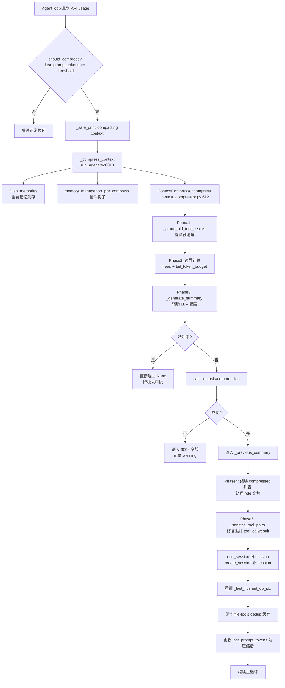
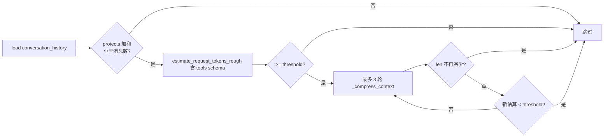

# L5 — 上下文压缩层（Context Compression Layer）分析报告

> **层职责**：当 `messages` 累计的 token 接近模型 context window 的阈值时，自动将"中段"对话通过辅助 LLM 压缩为结构化摘要，并保留"头"和"尾"完整原文，从而让长会话可持续推进。

## 1. 业务背景

Hermes Agent 的 agent 循环（L3，`run_agent.AIAgent`）会持续把 user / assistant / tool 消息追加到 `messages` 列表中。对长任务（多步骤代码重构、长会话调试、跨工具调用的探索）而言，消息列表会迅速撞到模型 context window 上限。LLM 自身在请求被拒（HTTP 400 / 413 / `context_length_exceeded`）时只能让对话终止或被迫重置。

ContextCompressor 解决的是 "持续滚动而不丢失关键上下文" 问题。设计目标：

- **保留头尾**：system prompt、第一条 user 消息、最后若干条消息必须完整保留（模型短期注意力最敏感的两端）。
- **压缩中段**：用廉价的辅助模型生成结构化摘要，喂回 LLM 当作 "hypothesis context"。
- **失败容错**：辅助 LLM 不可用时，宁可丢中段也不插入占位假数据污染推理。
- **多次压缩时不丢信息**：上一次摘要作为输入参与下一轮合并（"iterative update"），借鉴 Pi-mono / OpenCode 风格。

## 2. 业务流程

### 2.1 主流程概览（mermaid）



### 2.2 Preflight 流程

进入主循环前还要再检查一次历史会话是否已经超阈值（处理 "换小窗口模型" 的场景）：



代码位置：`run_agent.py:7184-7240`。

### 2.3 触发条件

`should_compress()` 的核心判定 (`context_compressor.py:131-139`) 极为简洁：

```python
def should_compress(self, prompt_tokens: int = None) -> bool:
    tokens = prompt_tokens if prompt_tokens is not None else self.last_prompt_tokens
    return tokens >= self.threshold_tokens
```

阈值 `threshold_tokens` 在 `__init__` 中由 `threshold_percent * context_length` 推导（默认 50%），`context_length` 由 `get_model_context_length()` 多源解析。

调用链：
- `run_agent.py:9019` — 主循环末尾 `should_compress(_real_tokens)` 触发
- `run_agent.py:7204` — Preflight 用 `estimate_request_tokens_rough()` 估算
- `run_agent.py:9014` (状态栏) — 不触发压缩，只计算 `compaction_progress` 用于压力提示

## 3. 技术架构

### 3.1 关键类 / 函数

| 名称 | 位置 | 职责 |
|------|------|------|
| `ContextCompressor` | `agent/context_compressor.py:53` | 压缩编排、状态机、摘要 prompt 构建 |
| `ContextCompressor.should_compress` | `:131` | 阈值判定 |
| `ContextCompressor.should_compress_preflight` | `:136` | 用 `estimate_messages_tokens_rough` 预判（不依赖 API usage） |
| `ContextCompressor._prune_old_tool_results` | `:155` | Phase 1：廉价清理老 tool result |
| `ContextCompressor._find_tail_cut_by_tokens` | `:550` | Phase 2：按 token 预算定位尾边界 |
| `ContextCompressor._align_boundary_forward/backward` | `:512/522` | 防止边界切断 tool_call/result 组 |
| `ContextCompressor._generate_summary` | `:287` | Phase 3：调 `call_llm(task="compression")` |
| `ContextCompressor._serialize_for_summary` | `:236` | 把 messages 序列化为可读文本 |
| `ContextCompressor._sanitize_tool_pairs` | `:452` | Phase 5：修复孤儿 tool_call/result |
| `ContextCompressor.compress` | `:612` | 5 phase 编排主入口 |
| `call_llm` | `agent/auxiliary_client.py:1962` | 辅助 LLM 调用入口 |
| `resolve_provider_client` | `agent/auxiliary_client.py:1176` | 集中式 provider 路由 |
| `_resolve_auto` | `agent/auxiliary_client.py:1096` | auto 模式解析链 |
| `_try_payment_fallback` | `agent/auxiliary_client.py:1050` | 402/credit 错误时换 provider |
| `get_model_context_length` | `agent/model_metadata.py:842` | 多源解析模型 context window |
| `estimate_messages_tokens_rough` | `agent/model_metadata.py:979` | 4 字符/token 粗估（preflight 用） |
| `estimate_request_tokens_rough` | `agent/model_metadata.py:985` | 同上 + tools schema + system prompt |
| `AIAgent._compress_context` | `run_agent.py:6013` | 编排：flush memory → compress → split session |

### 3.2 设计模式

- **策略模式（Provider 解析链）**：`auxiliary_client._resolve_auto` 通过 `_get_provider_chain()` 顺序尝试多个 provider 函数对象（`_try_openrouter / _try_nous / _try_custom_endpoint / _try_codex / _resolve_api_key_provider`），运行期构建避免测试 patch 失效。
- **适配器模式（多 API 协议归一）**：`CodexAuxiliaryClient` 和 `AnthropicAuxiliaryClient` 把 Responses API / Anthropic Messages API 都包装成 `client.chat.completions.create()` 调用，上层不感知。
- **模板方法（5-phase 流水线）**：`ContextCompressor.compress` 是固定骨架，phase 1/2/5 不调 LLM，phase 3 是唯一 LLM 调用点。
- **增量更新（Iterative Update）**：`_previous_summary` 跨多次压缩累积信息，避免 "summary 丢 summary 丢 summary" 的雪崩。
- **预算驱动（Token Budget）**：tail 保护不再用固定消息数，用 `tail_token_budget = threshold_tokens * summary_target_ratio`。

## 4. 核心实现细节

### 4.1 五个 Phase 的算法

#### Phase 1：工具输出裁剪（`_prune_old_tool_results`）

- 位置：`context_compressor.py:155-210`
- 触发条件：`role == "tool"` 且 `len(content) > 200`。
- 边界算法：优先 token 预算（`protect_tail_tokens`），否则回退消息数（`protect_tail_count`）。
- 替换为固定占位符 `_PRUNED_TOOL_PLACEHOLDER = "[Old tool output cleared to save context space]"`。
- 不调 LLM，O(N) 字符串操作，成本可忽略。

#### Phase 2：边界计算

- **头边界** `compress_start = protect_first_n`（默认 3），再过 `_align_boundary_forward` 跳过开头的孤立 tool 消息。
- **尾边界** `compress_end = _find_tail_cut_by_tokens(...)`：
  - 从尾部反向累计 `accumulated_tokens`，超过 `soft_ceiling = token_budget * 1.5` 时停。
  - `min_tail = 3` 永远保护至少 3 条消息。
  - 通过 `_align_boundary_backward` 在切断点回退到 assistant 父消息。
- **token 预算的计算**：

```python
target_tokens = int(self.threshold_tokens * self.summary_target_ratio)  # 50% * 20% = 10% of ctx
self.tail_token_budget = target_tokens
self.max_summary_tokens = min(int(self.context_length * 0.05), _SUMMARY_TOKENS_CEILING=12_000)
```

举例：128K 上下文 → 阈值 64K → tail budget 12.8K，max summary 6.4K。

#### Phase 3：摘要生成（`_generate_summary`）

- 入口：`call_llm(task="compression", messages=[...prompt...], max_tokens=summary_budget*2)`。
- **冷却门控**：`now < _summary_failure_cooldown_until` 直接返回 `None` 不调 LLM。
- **摘要预算**：取 `content_tokens * 0.20`，再 clamp 到 `[_MIN_SUMMARY_TOKENS=2000, max_summary_tokens]`。
- **序列化**：把 messages 转成 `[USER] / [ASSISTANT] / [TOOL RESULT id=...]` 的纯文本。
- **存储**：成功后 `self._previous_summary = summary`，重置冷却时间，归一化 prefix。

#### Phase 4：组装 compressed 列表

- 头部：保留前 `protect_first_n` 条；首次压缩时在 system prompt 末尾追加提示。
- 摘要消息角色选择：
  - `last_head_role == "assistant" | "tool"` → `summary_role = "user"`
  - `last_head_role == "user"` → `summary_role = "assistant"`
  - 如果 chosen role 与 first_tail_role 冲突 → 翻转（flip）
  - 翻转后仍冲突（头/尾夹击）→ 合并到首条 tail 消息开头

#### Phase 5：孤儿 tool_call/result 修复（`_sanitize_tool_pairs`）

- 位置：`context_compressor.py:452-510`
- 问题 1：tool result 的 `call_id` 找不到对应 assistant `tool_calls` → 移除该 result。
- 问题 2：assistant 的 `tool_calls` 找不到对应 result → 插入 stub result。
- 不做此修复，OpenAI/Anthropic 都会返回 `No tool call found for function call output with call_id ...` 400 错误。

### 4.2 辅助 LLM 解析链

辅助 LLM 客户端的解析在 `auxiliary_client.py` 中。`call_llm(task="compression", ...)` 的解析路径：

```
[显式 args] provider / model / base_url / api_key (最高优先)
    ↓ 未指定
[AUXILIARY_COMPRESSION_*] / [CONTEXT_COMPRESSION_*] 环境变量
    ↓ 未指定
[config.yaml] auxiliary.compression.* 或 compression.* 旧字段
    ↓ 未指定 / "auto"
[_resolve_auto]
    ↓
[Step 1] 如果主 provider 非聚合器 (OpenRouter/Nous) 且有 creds → 用主 provider + 主模型
    ↓
[Step 2] _get_provider_chain() 顺序尝试:
    1. _try_openrouter    (OPENROUTER_API_KEY)
    2. _try_nous          (~/.hermes/auth.json)
    3. _try_custom_endpoint (config.yaml base_url)
    4. _try_codex         (Codex OAuth + Responses API)
    5. _resolve_api_key_provider (PROVIDER_REGISTRY 兜底)
```

#### 402 / 信用耗尽降级

`call_llm()` 捕获到 `_is_payment_error(first_err)` 时，调 `_try_payment_fallback` 跳过当前 provider 重试整个 chain。

### 4.3 Token 预算与保护机制汇总

| 变量 | 公式 | 默认值 |
|------|------|--------|
| `context_length` | `get_model_context_length()` 多源解析 | 128K fallback |
| `threshold_tokens` | `context_length * threshold_percent` | 64K（50%） |
| `tail_token_budget` | `threshold_tokens * summary_target_ratio` | 12.8K |
| `max_summary_tokens` | `min(context_length * 0.05, 12_000)` | 6.4K |
| `_MIN_SUMMARY_TOKENS` | 常量 | 2000 |
| 软上限（防单条巨消息） | `tail_token_budget * 1.5` | 19.2K |
| 硬地板 tail 消息数 | `min(3, n - head - 1)` | 3 |
| 摘要失败冷却 | `_SUMMARY_FAILURE_COOLDOWN_SECONDS` | 600s |

### 4.4 摘要 Prompt 设计

首次压缩 prompt，8 个固定 section：

| Section | 用途 |
|---------|------|
| `## Goal` | 用户真正要达成的目标 |
| `## Constraints & Preferences` | 用户偏好、编码风格、技术约束 |
| `## Progress` | `### Done / ### In Progress / ### Blocked` 三态进度 |
| `## Key Decisions` | 重要技术决策及理由 |
| `## Relevant Files` | 读/写/创建过的文件 |
| `## Next Steps` | 下一步要做什么 |
| `## Critical Context` | 具体值、错误信息、配置、关键数据 |
| `## Tools & Patterns` | 工具调用模式、有效的 flag、踩过的坑 |

## 5. 跨层交互

### 5.1 与 L3（Agent Loop）的契约

调用方：`run_agent.AIAgent._compress_context`。

**返回契约**：
- `(compressed_messages, new_system_prompt)` 元组
- 会**自动 end 旧 session + create 新 session**，新 session_id 带 `parent_session_id` 关联
- 会重置 `_last_flushed_db_idx=0` 防止 session DB 重复写入

### 5.2 与 L6（持久化层）的契约

- 第一次压缩时改写 system prompt，追加 handoff summary 提示
- system prompt 改写只发生在 `compression_count == 0`

### 5.3 与 L4（Tool Layer）的契约

- L5 不直接 import 任何 tool，只读 `role / content / tool_calls / tool_call_id` 字段——**零耦合**

## 6. 异常处理

### 6.1 摘要失败冷却机制

`_SUMMARY_FAILURE_COOLDOWN_SECONDS = 600` (10 分钟)。冷却期间 `_generate_summary` 直接返回 None，`compress()` 仍然运行但中段消息被静默丢弃。

**为什么用 `monotonic()` 而不是 `time.time()`**：避免系统时钟跳变导致冷却期异常长或异常短。

### 6.2 角色冲突合并降级

当 head 和 tail 都是 `assistant` 角色时无法插入 standalone summary 消息，退化为把 summary 内容 prepend 到第一条 tail 消息的开头。

### 6.3 重复压缩质量警告

`compression_count >= 2` 时主动给用户打印警告 `⚠️ Session compressed N times — accuracy may degrade`。

## 7. 性能与安全

### 7.1 性能

- **廉价预清理优先**（Phase 1）：`_prune_old_tool_results` 纯字符串操作，O(N) 不调 LLM
- **token 预算反算**：`_find_tail_cut_by_tokens` 也是 O(N) 反向扫描
- **LLM 唯一调用点**：Phase 3 `_generate_summary`，受冷却门控
- **客户端缓存**：OpenAI / AsyncOpenAI 客户端全局缓存

### 7.2 安全

- **不入占位假数据**：摘要失败时**直接丢中段**
- **不暴露内部异常**：`compress()` 不向上抛异常
- **敏感数据不日志化**：只输出 token 计数 + 消息数
- **JWT 过期检测**：过期 token 视为不可用

## 8. 关键洞察

1. **"廉价预清理 + 智能摘要"是分层防御**：Phase 1 字符串操作成本几乎为零，能解决 70% 场景
2. **token 预算反向工程是 L5 设计的灵魂**：让保护规模与模型能力线性挂钩
3. **迭代摘要 = 信息累积而非覆盖**：`_previous_summary` 跨多次压缩保留
4. **5-phase 拆解 = 故障隔离**：phase 1/2/5 不依赖 LLM，永远成功
5. **provider 解析链是配置层的"水"**：5 个 provider 顺序 + 402 fallback + JWT 过期检测
6. **角色冲突合并是隐藏的协议防御**：防止 assistant-as-summary 直接 400
7. **preflight 3 轮循环是性能护栏**：单次压缩可能一次压不够
8. **`compression_count` 触发质量警告**：把"压缩后效果变差"显性化给用户

---

*本报告由分析 agent 生成，源文件：context_compressor.py, auxiliary_client.py, model_metadata.py, run_agent.py*
