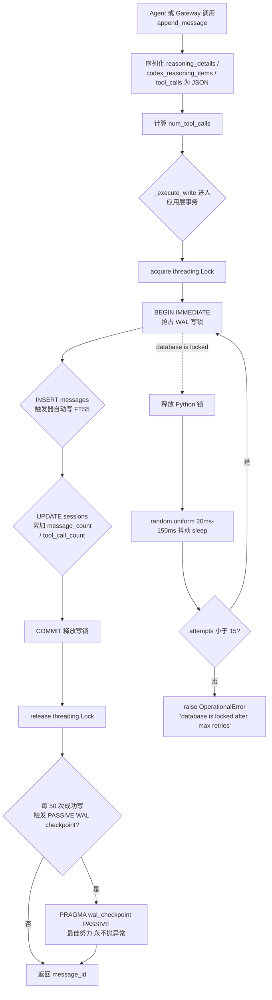
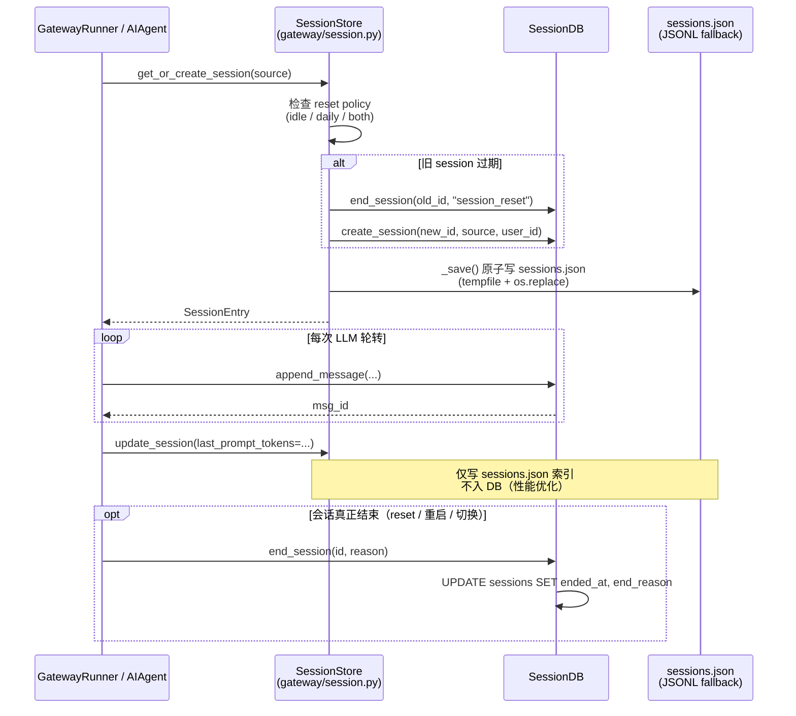
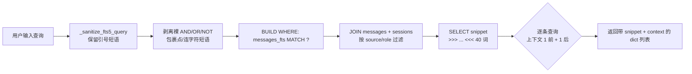

# L6 - 会话持久化层（Session Persistence Layer）

> 分析对象：`SessionDB.append_message` + `WAL commit` + `jitter retry` + 轨迹/压缩持久化
> 关键文件：
> - `D:/DevSpace/person/ai_space/hermes-agent/hermes_state.py`
> - `D:/DevSpace/person/ai_space/hermes-agent/agent/trajectory.py`
> - `D:/DevSpace/person/ai_space/hermes-agent/gateway/session.py`

---

## 1. 业务背景

Hermes Agent 是一个"自我进化"的多平台 AI 代理（CLI + Telegram/Discord/Slack/WhatsApp/Signal 等）。其核心对话循环（`run_agent.py::AIAgent`）需要把每一条用户/助手/工具消息、每一次 token 消耗、每一个 system prompt 快照**持久化**到磁盘，以便：

1. **跨进程恢复**：用户在 Telegram 发起会话，Hermes Gateway 进程处理；用户切换到 CLI，会话历史不丢。
2. **全文检索**：用户搜索"docker deployment"，需要在所有平台、所有会话中跨表匹配。
3. **成本/账单溯源**：按 session 维度聚合 input/output/cache_read/cache_write/reasoning tokens。
4. **多代连续推理**：支持 OpenRouter / OpenAI / Nous 等需要"回放 reasoning"的模型，在新 turn 重新加载 `reasoning` + `reasoning_details` + `codex_reasoning_items`（`hermes_state.py:83-84`、`979-991`）。
5. **会话谱系与压缩**：通过 `parent_session_id` 链，把"压缩后产生的新 session"挂回原 session，避免一次性塞满上下文窗口（`hermes_state.py:48`）。
6. **批量训练数据落盘**：RL 训练子模块（tinker-atropos）依赖 `agent/trajectory.py::save_trajectory` 写出 JSONL。

为此，团队放弃了早年的"per-session JSONL 文件"方案（`gateway/session.py:967-969` 仍保留 fallback 兼容），把会话/消息/全文索引统一到 **SQLite + WAL + FTS5** 的 `SessionDB` 中。`hermes_state.py:5-15` 的模块注释明确指出关键设计权衡：WAL 并发、FTS5 全文检索、parent_session_id 谱系、batch runner 与 RL 轨迹走独立管线。

---

## 2. 业务流程

### 2.1 单条消息写入（核心路径）



### 2.2 会话结束持久化（`on_session_end` 路径）



### 2.3 全文检索（`search_messages`）



---

## 3. 技术架构

### 3.1 关键类/函数表

| 层级 | 类 / 函数 | 位置 | 职责 |
|------|----------|------|------|
| 存储 | `SessionDB` | `hermes_state.py:115` | SQLite + WAL + FTS5 会话持久化主类 |
| 存储 | `SessionDB._execute_write` | `hermes_state.py:164` | BEGIN IMMEDIATE + 抖动重试核心 |
| 存储 | `SessionDB._try_wal_checkpoint` | `hermes_state.py:216` | PASSIVE 模式 checkpoint，最佳努力 |
| 存储 | `SessionDB.append_message` | `hermes_state.py:857` | 单条消息原子写入 + 计数累加 |
| 存储 | `SessionDB.search_messages` | `hermes_state.py:1052` | FTS5 全文搜索 + 上下文拉取 |
| 存储 | `SessionDB._sanitize_fts5_query` | `hermes_state.py:1000` | FTS5 注入防护 + 短语保留 |
| 存储 | `SessionDB.get_messages_as_conversation` | `hermes_state.py:951` | 还原 OpenAI 风格多轮对话 |
| 存储 | `SessionDB.update_token_counts` | `hermes_state.py:412` | 增量 / 绝对两种 token 累加模式 |
| 存储 | `SessionDB.set_session_title` | `hermes_state.py:672` | 标题唯一性约束（`WHERE title IS NOT NULL`） |
| 存储 | `SessionDB.delete_session` | `hermes_state.py:1237` | 孤儿化子会话后删除（不级联） |
| 网关 | `SessionStore` | `gateway/session.py:504` | 索引 + SQLite 双写管理层 |
| 网关 | `SessionStore.get_or_create_session` | `gateway/session.py:693` | reset policy 评估 + DB 联动 |
| 网关 | `SessionStore.append_to_transcript` | `gateway/session.py:943` | SQLite + JSONL 双写（`skip_db` 防重复写） |
| 网关 | `SessionStore.rewrite_transcript` | `gateway/session.py:971` | 压缩 / /undo / /retry 重写整段 |
| 网关 | `SessionStore.load_transcript` | `gateway/session.py:1003` | SQLite vs JSONL 取最长源（防静默截断） |
| 网关 | `build_session_key` | `gateway/session.py:445` | DM/Group/Thread 的 session key 构造 |
| 轨迹 | `save_trajectory` | `agent/trajectory.py:30` | JSONL 追加写（成功/失败分流） |
| 轨迹 | `convert_scratchpad_to_think` | `agent/trajectory.py:16` | 标签替换以适配外部训练框架 |

### 3.2 设计模式

- **DAO（Data Access Object）**：`SessionDB` 封装所有 SQLite 访问细节，外部仅看到 append / search / get_messages 这类语义化方法。
- **双层索引（SQLite + JSONL）**：`SessionStore` 维持"DB 存事实 + sessions.json 存轻量索引"的过渡形态，`skip_db` 标志解决重复写 bug（`gateway/session.py:950-951` 注释引用 issue #860）。
- **Schema 渐进迁移**：`hermes_state.py:252-341` 实现 v1→v6 的逐步升级，每次启动检测 `schema_version` 表并执行相应 `ALTER TABLE` + 异常吞掉（`ALTER TABLE ADD COLUMN` 重复执行安全）。
- **Source 标签 + 谱系**：`sessions.source`（`'cli'`, `'telegram'`...）+ `parent_session_id` 支持后续按平台过滤、按谱系追溯压缩断点。
- **PII 最小化**：`gateway/session.py:38-58` 用 SHA-256 前 12 位把 sender/chat id 哈希成 `user_<12hex>`，仅在 `_PII_SAFE_PLATFORMS`（WhatsApp/Signal/Telegram/BlueBubbles）下发到 LLM；Discord 因 mention 语法 `<@user_id>` 保留原文。

---

## 4. 核心实现细节

### 4.1 WAL + 应用层 Jitter Retry（`hermes_state.py:123-214`）

**为什么不上 SQLite 内置 busy handler？**
- 多 hermes 进程（gateway + CLI + worktree agent）共享 `state.db` 时，WAL 写锁竞争导致 TUI 卡顿。
- SQLite 自带 busy handler 是**确定性退避**（每次 sleep 时长固定），并发写者会形成"convoy effect"（一连串线程在同一时刻唤醒、撞锁、再 sleep）。
- 解决方案（`hermes_state.py:125-131` 注释）：**短 timeout（1s）+ 应用层 20-150ms 随机 jitter + 最多 15 次重试**。

**关键代码骨架**（`hermes_state.py:132-136`）：
```python
_WRITE_MAX_RETRIES = 15
_WRITE_RETRY_MIN_S = 0.020
_WRITE_RETRY_MAX_S = 0.150
_CHECKPOINT_EVERY_N_WRITES = 50
```

重试循环（`hermes_state.py:179-214`）：
```python
for attempt in range(self._WRITE_MAX_RETRIES):
    try:
        with self._lock:                       # Python 层锁，序列化进程内写
            self._conn.execute("BEGIN IMMEDIATE")  # WAL 写锁立即抢占
            try:
                result = fn(self._conn)
                self._conn.commit()
            except BaseException:
                self._conn.rollback()
                raise
        self._write_count += 1
        if self._write_count % 50 == 0:
            self._try_wal_checkpoint()         # 最佳努力 PASSIVE checkpoint
        return result
    except sqlite3.OperationalError as exc:
        if "locked" in str(exc).lower() and attempt < 14:
            time.sleep(random.uniform(0.020, 0.150))   # 抖动退避
            continue
        raise
```

**要点**：
1. `BEGIN IMMEDIATE`（不是 `BEGIN`/`DEFERRED`）让写锁在事务开始就抢占，失败立刻返回，避免在 commit 时才暴露冲突。
2. Python `threading.Lock` 仅保护**进程内**的串行写（`check_same_thread=False` + 多 reader + 单 writer 模型）；**跨进程**靠 `BEGIN IMMEDIATE` + `database is locked` 重试。
3. `_try_wal_checkpoint` 使用 `PASSIVE` 模式（不阻塞其他连接的读写），只 flush 那些"没人引用的 WAL 帧"，因此即便失败也不抛异常（`hermes_state.py:234-235`）。
4. `close()` 退出前再触发一次 PASSIVE checkpoint（`hermes_state.py:243-248`），避免后台进程长期持有连接让 WAL 无限增长。

### 4.2 FTS5 索引维护（`hermes_state.py:93-112`）

`messages_fts` 是 `content=messages, content_rowid=id` 的外部内容表（external content table），由三个触发器自动同步：

| 触发器 | 时机 | 行为 |
|--------|------|------|
| `messages_fts_insert` | `AFTER INSERT ON messages` | `INSERT INTO messages_fts(rowid, content)` |
| `messages_fts_delete` | `AFTER DELETE ON messages` | `INSERT INTO messages_fts('delete', rowid, content)`（特殊命令） |
| `messages_fts_update` | `AFTER UPDATE ON messages` | 先 `delete` 旧行，再 `insert` 新行 |

`FTS_SQL` 不放进主 `executescript`（`hermes_state.py:344-347` 注释：`CREATE VIRTUAL TABLE IF NOT EXISTS` 在 `executescript` 中行为不可靠），先 `SELECT * FROM messages_fts LIMIT 0` 探测表是否存在，失败才执行整个 FTS 脚本。

**FTS5 注入防护**（`hermes_state.py:1000-1050`）：`_sanitize_fts5_query` 是 6 步流水线：
1. 用占位符 `\x00Q{n}\x00` 提取并保留成对引号短语；
2. 剥离残留的 `+{}()\"^`；
3. 折叠连续 `*` 并去除行首裸 `*`；
4. 删除首尾悬空的 `AND`/`OR`/`NOT`；
5. 用正则 `\b(\w+(?:[.-]\w+)+)\b` 把"连字符或点分隔"的词（如 `chat-send`、`P2.2`）整体加引号，避免被 FTS5 tokenizer 拆词；
6. 还原占位符为原引号短语。

`search_messages`（`hermes_state.py:1102-1128`）使用 `snippet(messages_fts, 0, '>>>', '<<<', '...', 40)` 提取高亮片段，并**在锁外**逐条拉取上下文（`id ± 1`），避免一个长 lock 横跨 N 次 query。

### 4.3 `append_message` 完整流程（`hermes_state.py:857-930`）

**预序列化阶段**（事务外）：
- `reasoning_details` / `codex_reasoning_items` / `tool_calls` 若是 dict/list，先 `json.dumps`；
- `num_tool_calls = len(tool_calls) if isinstance(list) else 1`，用于后面累加 `tool_call_count`。

**事务内（`_execute_write`）**：
1. `INSERT INTO messages (...) VALUES (...)`，13 列覆盖 role/content/tool_call_id/tool_calls/tool_name/timestamp/token_count/finish_reason/reasoning/reasoning_details/codex_reasoning_items（`hermes_state.py:71-85` 的 schema）；
2. `cursor.lastrowid` 取到 `msg_id`；
3. 根据 `num_tool_calls` 决定 `UPDATE` 语句：>0 时同步累加 `tool_call_count`，否则只 `message_count + 1`；
4. `COMMIT`，触发器自动同步 FTS5；
5. 累计 `_write_count`，每 50 次触发 PASSIVE checkpoint。

**字段含义**：
- `role`：`user` / `assistant` / `tool` / `system`；
- `content`：纯文本内容（FTS5 索引的就是它）；
- `tool_calls` / `tool_call_id` / `tool_name`：OpenAI tool calling 协议回放所需的最小集；
- `reasoning` / `reasoning_details` / `codex_reasoning_items`：v6 schema 升级新增（`hermes_state.py:313-331`），用于推理链跨 turn 重放。

### 4.4 Trajectory 保存与压缩（`agent/trajectory.py` + `gateway/session.py::rewrite_transcript`）

**Trajectory JSONL**（`agent/trajectory.py:30-56`）：
- 与 `SessionDB` **完全独立**的写路径——这是 `hermes_state.py:13` 注释强调的"batch runner 和 RL 轨迹走独立管线"。
- 入口：`save_trajectory(trajectory, model, completed, filename=None)`；
- `filename` 默认分流：`completed=True` 走 `trajectory_samples.jsonl`，失败走 `failed_trajectories.jsonl`；
- 写入条目含 `conversations`（ShareGPT 格式）、`timestamp`（ISO）、`model`、`completed` 四个字段，追加（`open(..., "a")`）；
- 失败仅 `logger.warning`，不抛——保护 RL 训练主流程；
- `convert_scratchpad_to_think`（`agent/trajectory.py:16-20`）把内部 `<REASONING_SCRATCHPAD>` 标签替换成 `<think>`，适配外部训练框架。

**压缩 / /retry / /undo 的 transcript 重写**（`gateway/session.py:971-1001`）：
- `rewrite_transcript(session_id, messages)` 顺序为：先 `clear_messages(session_id)` 清空 + 复位 `message_count=0`、`tool_call_count=0`，再循环 `append_message`；
- 仅 `role == "assistant"` 的消息会保留 `reasoning` / `reasoning_details` / `codex_reasoning_items` 三字段（`gateway/session.py:990-992`），其他角色显式置 None，避免污染 tool/user 行的 FTS5 索引和反序列化逻辑；
- 双写：SQLite 成功后**直接覆盖** JSONL 文件（`open(..., "w")`）。

**`load_transcript` 防截断逻辑**（`gateway/session.py:1030-1047`）：
- 同时加载 SQLite 和 JSONL，返回**更长**的那个；
- 原因：迁移期老 session 还在 JSONL 里、SQLite 仅有最近若干 turn，盲目信任 SQLite 会把上下文"无声截断"为 1-4 条消息，模型看到的上下文彻底崩盘。

---

## 5. 跨层交互（与 L2/L3 的契约）

### 5.1 L2 - LLM 调用层（`run_agent.py::AIAgent`）

| 调用方向 | 契约 | 位置 |
|---------|------|------|
| L2 → L6 | `SessionDB.append_message(role, content, tool_calls, reasoning, ...)` 每次轮转一次 | `hermes_state.py:857` |
| L2 → L6 | `update_token_counts(..., absolute=False)` 每次 API 调用累加 delta | `hermes_state.py:412` |
| L2 → L6 | `update_system_prompt(snapshot)` 在 system prompt 重组后持久化 | `hermes_state.py:403` |
| L2 → L6 | `end_session(reason)` 在 `/exit` / `/reset` / 异常时收尾 | `hermes_state.py:385` |
| L2 → L6 | `ensure_session(...)` 失败恢复：建 session 行时若瞬时锁失败，下次 retry 时先 ensure 再 append | `hermes_state.py:502` |

**强契约**：
- `append_message` 调用方**不得**自己 `commit`（`_execute_write` 统一处理，`hermes_state.py:167-168` 显式约束）。
- token 累加的两套语义（增量 vs 绝对）必须由调用方按上下文选择：`absolute=False` 用于 CLI 每次 API delta；`absolute=True` 用于 gateway 缓存代理的"已累计值"（`hermes_state.py:430-439`）。

### 5.2 L3 - 多平台适配层（`gateway/session.py`）

| 调用方向 | 契约 | 位置 |
|---------|------|------|
| L3 → L6 | `SessionStore.append_to_transcript` 走 SQLite + JSONL 双写 | `gateway/session.py:943` |
| L3 → L6 | `skip_db=True` 标志：让 agent 已经自己写过 DB 的路径不再重复写 | `gateway/session.py:950-951` |
| L3 → L6 | `rewrite_transcript` 在 `/retry` `/undo` `/compress` 后整段重写 | `gateway/session.py:971` |
| L3 → L6 | `end_session + create_session` 在 reset policy 触发时 | `gateway/session.py:761-771` |
| L6 → L3 | 失败兜底：`try/except` 把 DB 异常降级为 `logger.debug`，不阻塞主对话 | `gateway/session.py:763-765, 869-873` |

**L3 独有的索引层**：`sessions.json`（`gateway/session.py:558-579`）是 `session_key → SessionEntry` 的轻量索引，**不入 DB**，原因：
- 频繁写（`update_session` 每次轮转一次），用 `tempfile + os.replace` 原子替换避免半写文件；
- 不需要跨平台查询，只在 gateway 单进程内存加载一次。

**DM 线程谱系"种子"**（`gateway/session.py:780-806`）：当 Slack 线程被创建为新 session 时，自动 `rewrite_transcript` 父 DM 会话历史到子线程——这是 `hermes_state.py:13` 提到的"压缩触发 session 拆分"在 SDK 层的具体表现。

---

## 6. 异常处理

| 场景 | 处理 | 位置 |
|------|------|------|
| SQLite 写锁竞争 | `database is locked` → 20-150ms 抖动 sleep → 重试 ≤ 15 次 | `hermes_state.py:198-208` |
| 15 次重试仍锁 | 重新 raise `OperationalError`，由上层决定是否降级 | `hermes_state.py:212-214` |
| 事务内任意异常 | `try/except BaseException` + `rollback()` 吞 rollback 异常 | `hermes_state.py:184-192` |
| FTS5 查询语法错误 | `_sanitize_fts5_query` 6 步清洗；残留错误 catch `OperationalError` 返回空列表 | `hermes_state.py:1125-1127` |
| ALTER TABLE 重复执行 | `OperationalError` 直接 pass（列已存在） | `hermes_state.py:267-270, 309-311, 328-330` |
| `set_session_title` 标题冲突 | 事务内 `SELECT` 检测冲突 → 抛 `ValueError` | `hermes_state.py:684-692` |
| 标题超长 | `sanitize_title` 抛 `ValueError` 长度超 100 | `hermes_state.py:666-668` |
| `prune_sessions` / `delete_session` 子会话 | 显式 UPDATE `parent_session_id=NULL` 孤儿化，避免 FK 违反 | `hermes_state.py:1251-1254, 1288-1293` |
| `save_trajectory` 写失败 | `logger.warning` 不抛，保护 RL 主流程 | `agent/trajectory.py:55-56` |
| Gateway DB 写失败 | `logger.debug` 不冒泡，绝不阻塞用户消息 | `gateway/session.py:763-765, 866-873` |
| `sessions.json` temp 文件残留 | `os.unlink(tmp_path)` finally 兜底 | `gateway/session.py:573-578` |
| `_try_wal_checkpoint` 任何异常 | `except Exception: pass` 最佳努力，**永不影响主流程** | `hermes_state.py:234-235` |
| `load_transcript` JSONL 坏行 | 逐行 try/except + `logger.warning` 跳过 | `gateway/session.py:1023-1028` |

整体风格：**核心路径（写入）严格抛错并重试，外围路径（搜索、checkpoint、JSONL 索引）宽容降级不抛**——这与 CLAUDE.md 第三章"业务异常统一处理" + "Fast Fail" 原则不冲突，因为 L6 是基础设施层而非业务层，过度抛错会拖垮 TUI/CLI 体验。

---

## 7. 性能与安全

### 7.1 性能

| 优化点 | 机制 | 收益 |
|--------|------|------|
| WAL 并发读 | `PRAGMA journal_mode=WAL` | 多 reader 线程 + 单 writer 不互斥 |
| 应用层抖动退避 | `random.uniform(20, 150)ms` × 15 | 破 convoy，吞吐提升明显 |
| 进程内写串行 | `threading.Lock` + `check_same_thread=False` | 一次只发一个事务，绕开 SQLite 线程限制 |
| 索引覆盖 | `idx_sessions_source` / `idx_sessions_parent` / `idx_sessions_started DESC` / `idx_messages_session(session_id, timestamp)` | 列表 / 谱系 / 单 session 消息全部走索引 |
| FTS5 全文索引 | `messages_fts` 外部内容表 + 3 触发器 | 跨会话秒级搜索，不退化全表扫描 |
| List 查询 | 单条 SQL + 相关子查询生成 preview + last_active | 避免 N+2 |
| WAL checkpoint 节流 | 每 50 次写一次 PASSIVE | 不让 WAL 无限增长，又不阻塞热点路径 |
| `list_sessions` 默认排除子会话 | `WHERE parent_session_id IS NULL` | 大幅减少 UI 噪音 |
| 双源取长（SQLite vs JSONL） | 比较 `len()` 后取最大 | 防止迁移期上下文被静默截断 |
| 子会话孤儿化删除 | 不用 CASCADE FK | 显式控制，避免误删压缩产生的子 session |

### 7.2 安全

- **PII 哈希**：`gateway/session.py:38-58` 用 SHA-256 前 12 位哈希 user/chat id；`_PII_SAFE_PLATFORMS` 限定在 WhatsApp/Signal/Telegram/BlueBubbles（Discord 排除因 mention 语法需要原文）。
- **FTS5 注入防护**：`_sanitize_fts5_query` 完整清洗用户输入（`hermes_state.py:1000-1050`）。
- **标题净化**：`sanitize_title` 去掉 ASCII 控制字符（0x00-0x1F, 0x7F）+ 零宽字符 + 双向控制符（`hermes_state.py:648-657`），防止终端劫持 / 隐藏文本攻击。
- **标题唯一性**：`CREATE UNIQUE INDEX ... ON sessions(title) WHERE title IS NOT NULL`（`hermes_state.py:283-285`）防止恶意覆盖他人会话。
- **LIKE 通配符转义**：`resolve_session_id` / `resolve_session_by_title` / `get_next_title_in_lineage` 都把 `\`、`%`、`_` 双重转义（`hermes_state.py:609-614, 732, 763`）。
- **DDL 标识符转义**：v5/v6 迁移里对列名做 `name.replace('"', '""')` 防御（`hermes_state.py:308, 325`），SQLite DDL 无法参数化，注释明确说明"硬编码 tuple，不是用户输入"。

---

## 8. 关键洞察

1. **WAL + 应用层 jitter 是 Hermes 多进程协作的"主动设计"**。SQLite 自带 busy handler 在多进程场景的 convoy 痛点被这段 90 行代码（`hermes_state.py:123-214`）精巧化解，这是 L6 与其他 SQLite 项目最大的差异化设计。

2. **`BEGIN IMMEDIATE` 比 `BEGIN DEFERRED` 更适合多进程**。它让锁竞争在事务开始就显式化，配合应用层重试可以把"看不到的 commit-time 阻塞"变成"可见的、可重试的、可观测的"错误路径。

3. **PASSIVE checkpoint 是"非阻塞最佳努力"哲学的极致**。`_try_wal_checkpoint`（`hermes_state.py:216-235`）和 `close()`（`hermes_state.py:243-248`）都把异常吃掉——这是基础设施层与服务层的边界：基础设施的临时失败不该让上层 UI 崩溃。

4. **"双写 + skip_db"是迁移期的典型反模式但被显式标注**。`gateway/session.py:943-969` 同时写 SQLite 和 JSONL，靠 `skip_db` 标志避免重复写 bug——这是技术债诚实管理的范本：保留双写可观测性、明确注释成因、用单一 boolean 控制可逆化。

5. **FTS5 是 Hermes "自我进化"的关键支柱**。`hermes_state.py:13` 提到 batch runner 和 RL 轨迹**不**进这个 DB，但 `messages_fts` 把所有用户历史变成可检索语料，配合 LLM 记忆系统形成"对用户说话"的能力。

6. **PII 防护是按平台精细化处理的**。`gateway/session.py:192-200` 把"哪些平台可以哈希 ID"做成白名单 frozenset，Discord 因 mention 语法 `<@user_id>` 保留原文——这避免了一个常见过度防御陷阱（"全部都哈希"会破坏 Discord 可用性）。

7. **v1→v6 的 schema 迁移是"幂等 + 容错"范本**。每次启动只检查 `schema_version` 数字，按需 `ALTER TABLE ADD COLUMN`，捕获 `OperationalError` 后 pass——即使 v5 / v6 反复执行也是安全的。

8. **load_transcript "取更长源"是数据迁移期的实用主义**。`gateway/session.py:1030-1047` 注释解释了为什么不能盲信 SQLite——这一行 `if len(jsonl_messages) > len(db_messages): return jsonl_messages` 防止了"老 session 上下文被无声截断"的生产事故。

9. **trajectory 与 SessionDB 完全解耦**。`agent/trajectory.py` 是独立 JSONL 追加写——这种"RL 训练数据走单独管线"的决定（`hermes_state.py:13` 注释）让训练迭代不会污染用户会话库。

10. **`parent_session_id` + `was_auto_reset` + `auto_reset_reason` 三件套支撑会话谱系可视化**。`gateway/session.py:377-380` + `hermes_state.py:48` 的 schema 让 `/resume`、`/compress`、`/reset` 的产物可以被工具链追溯，形成"用户感知层"与"存储层"的一致心智模型。
