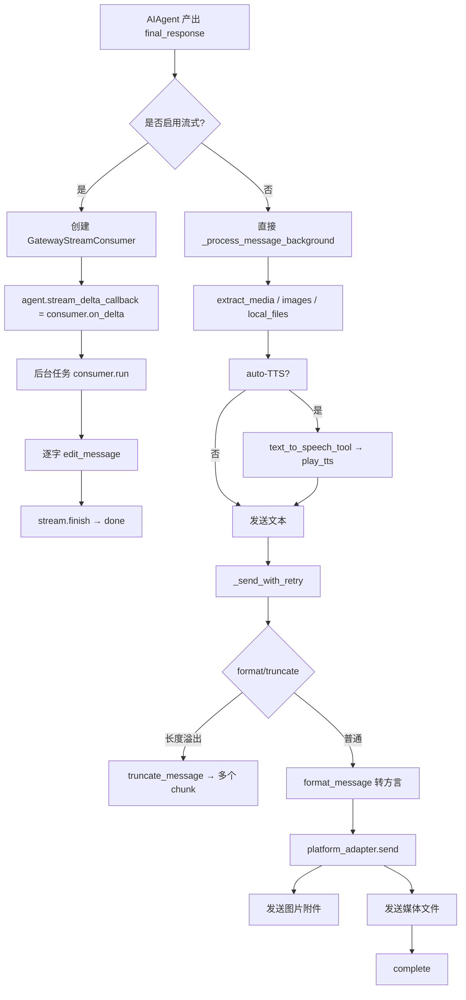

# Gateway Response Layer 分析文档

> Hermes Agent 跨平台消息分发层
> 负责将 Agent 生成的内容转换为各平台原生格式，并可靠地送达用户

---

## 1. 业务背景 (Business Context)

### 1.1 解决的业务问题

Hermes Agent 是一个多平台 AI 助手，用户的请求可能来自 Telegram、Discord、Slack、WhatsApp 等十余种不同的消息平台，而 Agent 自身只产出一份统一的 Markdown 文本与若干媒体文件。**Gateway Response Layer** 解决的核心问题是：

- **格式异构**：每个平台对 Markdown 的方言不同（Telegram 用 MarkdownV2，Slack 用 mrkdwn，Discord 接近 CommonMark，WhatsApp 几乎纯文本），格式转换是平台原生 API 能否接受的前置条件
- **长度限制**：Telegram 单条 4096 字符，Discord 单条 2000 字符，Slack 约 39000 字符，WhatsApp 65536 字符 —— 必须有智能分块机制
- **媒体提取**：Agent 返回的 `MEDIA:<path>` 标签、`` 链接、本地裸路径要被识别并改用平台原生附件 API 投递
- **渐进式反馈**：长任务中用户不应面对"沉默十几秒后突然冒出整段文字"的体验，需要流式 typing 提示 + 流式编辑
- **可靠投递**：网络抖动、Telegram 限流、Discord 系统消息、Slack 缺少 assistant scope 等异常必须被自动恢复
- **多目标路由**：cron 任务可以同时把结果投递到 home channel、用户原 channel、本地文件

### 1.2 在整体对话流中的位置

整个 Gateway 处理链可被划分为：入站（PlatformAdapter → MessageEvent）→ 业务处理（GatewayRunner._handle_message → AIAgent）→ **出站（Stream / format / send，本层）**。本层处于出站环节，是 Agent 产出物"最后一次蜕变"的地方。

```
┌──────────────┐   ┌──────────────┐   ┌────────────────────────────┐   ┌──────────────────┐
│  Ingest      │ → │  Runner      │ → │  RESPONSE LAYER (本文档)   │ → │  Platform APIs   │
│  (各 Adapter │   │  AIAgent     │   │  • format_message          │   │  • Telegram Bot  │
│   on_message)│   │  跑对话)     │   │  • truncate_message        │   │  • Discord HTTP  │
└──────────────┘   └──────────────┘   │  • extract_media / images  │   │  • Slack Web API │
                                       │  • _send_with_retry        │   │  • WhatsApp桥    │
                                       │  • GatewayStreamConsumer   │   └──────────────────┘
                                       │  • DeliveryRouter (cron)   │
                                       └────────────────────────────┘
```

### 1.3 关键用户可见行为

| 行为 | 用户视角 | 触发位置 |
|------|----------|----------|
| 消息逐字"打字" | 看到 `▉` 光标 → 文本逐步变长 | `GatewayStreamConsumer._send_or_edit` |
| 长回复自动分块 | 收到 `... (2/5)` 续段 | `truncate_message` + Telegram 末尾的 `\(2/5\)` 转义 |
| 图片/视频/音频/文件 | 收到原生附件而非 URL 链接 | `extract_images / extract_local_files / extract_media` |
| 语音消息自动 TTS | 收到语音气泡 + 文本回复 | `_process_message_background` 中的 auto-TTS 分支 |
| 配对码回复 | 新用户收到 `Hi~ I don't recognize you yet!` | `_handle_message` 拒绝授权分支 |
| 草稿命令回复 | `/new` 立即返回 `New session started` | `handle_message` 中的 command bypass 路径 |
| 错误恢复 | 收到 `⚠️ Message delivery failed` 提示 | `_send_with_retry` 多次重试后的兜底通知 |

---

## 2. 业务流程 (Business Flow)

### 2.1 出站主干流程（聊天响应）



### 2.2 关键决策点

1. **流式 vs 非流式**：`run_agent` 中根据模型与配置决定 `stream_delta_callback` 是否接入 `GatewayStreamConsumer`（`run.py:6749`）
2. **拦截与合并**：用户在 Agent 运行中再发消息 → `handle_message` 中 `cmd in ("approve", "deny", ...)` 走 inline dispatch，photo 走 album 合并，其余排队等当前 turn 完成
3. **格式化重试**：`TelegramAdapter.send` 中 MarkdownV2 失败时用 `_strip_mdv2` 退化为纯文本（`telegram.py:815-826`）
4. **chunk 末尾分页符转义**：Telegram 在 `truncate_message` 之后还要把 `(1/2)` 转成 `\((1/2)\)`，避免 MarkdownV2 把括号当语法（`telegram.py:773-776`）
5. **回复线程 vs 不回复**：`reply_to_mode = "off" | "first" | "all"` 控制是否 reply（Discord），Slack 通过 `reply_in_thread` 配置控制

### 2.3 错误 / 边缘情况处理

| 场景 | 检测 | 恢复策略 |
|------|------|----------|
| Telegram 429 flood | `RetryAfter` / `retry_after` 字段 | 指数退避（2s/4s），最多 3 次 |
| 线程被删 | `thread not found` | 清空 `message_thread_id` 后重发 |
| 回复目标被删 | `message to be replied not found` | 清空 `reply_to_message_id` 后重发 |
| MarkdownV2 解析失败 | `parse` / `markdown` in error | `_strip_mdv2` 退化为纯文本 |
| Discord 系统消息 | `Cannot reply to a system message` | `reference=None` 后重发 |
| 网络瞬断 | `_RETRYABLE_ERROR_PATTERNS` | 退避 2s/4s + 随机抖动 |
| 超时 | `TimedOut` | **不重试**（避免重复投递），标记 `retryable=False` |
| 编辑失败 | `edit_message().success=False` | 关闭 `_edit_supported`，后续 deltas 不再 edit，等终态时走 fallback |
| 上游格式异常 | 所有 send 重试后仍失败 | 注入 `(Response formatting failed, plain text:)` 前缀再发一次 |

---

## 3. 技术架构 (Technical Architecture)

### 3.1 关键类与函数

| 名称 | 文件:行 | 职责 |
|------|---------|------|
| `BasePlatformAdapter` | `gateway/platforms/base.py:475` | 抽象基类，定义 send/edit/typing/媒体投递接口与 `_send_with_retry` 默认实现 |
| `SendResult` | `gateway/platforms/base.py:442` | 统一返回结构 `{success, message_id, error, retryable}` |
| `MessageEvent` | `gateway/platforms/base.py:382` | 跨平台标准化入站事件 |
| `TelegramAdapter` | `gateway/platforms/telegram.py:111` | Telegram Bot API，MarkdownV2 12步转换 + 限流退避 |
| `DiscordAdapter` | `gateway/platforms/discord.py:409` | Discord.py gateway，反应表情钩子，typing 后台循环 |
| `SlackAdapter` | `gateway/platforms/slack.py:53` | Slack Bolt，mrkdwn 转换，assistant_threads_setStatus |
| `WhatsAppAdapter` | `gateway/platforms/whatsapp.py:103` | Node.js 桥接 HTTP，session_lock 互斥 |
| `GatewayStreamConsumer` | `gateway/stream_consumer.py:44` | 同步 delta 回调 → 异步渐进式 edit_message |
| `DeliveryRouter` | `gateway/delivery.py:107` | cron 任务多目标路由 |
| `DeliveryTarget` | `gateway/delivery.py:28` | 数据类：`platform / chat_id / thread_id / is_origin / is_explicit` |
| `format_message` | 各 Adapter 中 | 平台特定 Markdown 方言转换 |
| `truncate_message` | `base.py:1592` | 通用分块，保护代码围栏 |

### 3.2 设计模式

- **Template Method**：`BasePlatformAdapter` 提供 `_send_with_retry` / `truncate_message` / `extract_*` 等默认流程，子类只需实现 `send` 抽象方法
- **Strategy**：各 Adapter 的 `format_message` 实现不同的 markdown 转换策略
- **Producer/Consumer**：`GatewayStreamConsumer` 是经典实现 —— sync 线程（agent worker）→ `queue.Queue` → async task 消费
- **Data Transfer Object**：`MessageEvent` / `SendResult` / `DeliveryTarget` 都是 `@dataclass` 不可变 DTO
- **Adapter**：所有平台统一抽象为 `send(chat_id, content, reply_to, metadata) -> SendResult`
- **State**：`_active_sessions` / `_pending_messages` / `_running_agents` 维护 session 状态机
- **Observer**：`on_processing_start` / `on_processing_complete` 生命周期钩子（Discord 用它加 👀/✅/❌ 反应）

### 3.3 依赖与集成点

```
gateway/run.py
   ├── adapters: Dict[Platform, BasePlatformAdapter]
   │     ├── TelegramAdapter   → python-telegram-bot
   │     ├── DiscordAdapter    → discord.py
   │     ├── SlackAdapter      → slack-bolt / slack-sdk
   │     └── WhatsAppAdapter   → aiohttp → Node.js bridge
   ├── delivery_router: DeliveryRouter
   │     └── cron/ scheduler → cron_tick(adapters, loop)
   └── stream_consumer: GatewayStreamConsumer
         └── agent.stream_delta_callback ← run_agent.AIAgent
```

---

## 4. 核心实现细节 (Core Implementation Details)

### 4.1 Telegram MarkdownV2 12 步转换

`TelegramAdapter.format_message`（`telegram.py:1769-1924`）是整个项目最精巧的字符串处理逻辑之一。原因：Telegram MarkdownV2 要求**几乎所有特殊字符在代码块外必须用 `\` 转义**，但同时代码块、链接、引用、标题等又有自己的语法，所以必须先把"敏感区"用占位符冻结，再做转义，最后回填。

**12 步流水线**：

```mermaid
flowchart LR
    A[原始 markdown] --> B[1. 保护 ```fenced```<br/>内 \\ 和 ` 转义]
    B --> C[2. 保护 `inline`<br/>内 \\ 转义]
    C --> D[3. 转换链接<br/>[txt]→[esc(txt)]<br/>url内只esc \\ 与 )]
    D --> E[4. 转换标题<br/>## X → *esc(X)*]
    E --> F[5. **bold** → *esc()*]
    F --> G[6. *italic* → _esc()_]
    G --> H[7. ~~strike~~ → ~esc()~]
    H --> I[8. \|\|spoiler\|\| → \|\|esc()\|\|]
    I --> J[9. > 引用 保留前导 >]
    J --> K[10. _escape_mdv2 全文转义剩余特殊符]
    K --> L[11. 倒序回填占位符]
    L --> M[12. 兜底: 对非代码区再扫一遍 () {}]
    M --> N[可发送的 MarkdownV2]
```

**关键代码片段**（`telegram.py:1781-1809`）：

```python
placeholders: dict = {}
counter = [0]

def _ph(value: str) -> str:
    """Stash *value* behind a placeholder token that survives escaping."""
    key = f"\x00PH{counter[0]}\x00"   # NULL 字符做 token，普通文本不会撞
    counter[0] += 1
    placeholders[key] = value
    return key

# 1) Protect fenced code blocks (``` ... ```)
def _protect_fenced(m):
    raw = m.group(0)
    open_end = raw.index('\n') + 1 if '\n' in raw[3:] else 3
    opening = raw[:open_end]                 # 保留 ```lang\n
    body_and_close = raw[open_end:]
    body = body_and_close[:-3]              # 去掉闭合 ```
    body = body.replace('\\', '\\\\').replace('`', '\\`')  # 体内仍需转义
    return _ph(opening + body + '```')
```

**为什么用 NULL 字符做占位符**：`_MDV2_ESCAPE_RE` 不会匹配 `\x00`，所以占位符在第 10 步 `re.sub` 时不会被破坏，第 11 步倒序回填保证嵌套语义。

**退路机制**（`telegram.py:813-826`）：Telegram API 返回 `parse` 或 `markdown` 相关错误时，调用 `_strip_mdv2` 把所有 `\X` 与 `*X*` / `_X_` / `~X~` 标记去掉，发送纯文本。

### 4.2 智能分块 `truncate_message`

`base.py:1592-1701` 实现了**代码围栏感知的消息分块**：

- **优先级**：换行 > 空格 > 硬切
- **代码块边界**：上一 chunk 在代码块中结束 → 关闭 `\n```` 并把语言标签 `carry_lang` 带到下一 chunk 头部重新打开
- **inline code 保护**：检测到奇数个非转义反引号时，把切点前移以避免破坏 `code`
- **chunk 指示器**：超过 1 chunk 时附加 ` (1/3)` 形式的页码

```python
# base.py:1644-1663
candidate = remaining[:split_at]
backtick_count = candidate.count("`") - candidate.count("\\`")
if backtick_count % 2 == 1:
    last_bt = candidate.rfind("`")
    while last_bt > 0 and candidate[last_bt - 1] == "\\":
        last_bt = candidate.rfind("`", 0, last_bt)
    if last_bt > 0:
        safe_split = candidate.rfind(" ", 0, last_bt)
        nl_split = candidate.rfind("\n", 0, last_bt)
        safe_split = max(safe_split, nl_split)
        if safe_split > headroom // 4:
            split_at = safe_split
```

Telegram 还需要把 `(1/2)` 改成 `\((1/2)\)`，否则 MarkdownV2 会把 `(` 当成链接开始（`telegram.py:773-776`）。

### 4.3 流式消费者 `GatewayStreamConsumer`

`gateway/stream_consumer.py` 是从 sync agent worker 到 async platform transport 的桥。

**关键状态**（`stream_consumer.py:59-78`）：
- `_queue: queue.Queue` —— 线程安全队列
- `_message_id: Optional[str]` —— 当前正在编辑的消息 ID
- `_edit_supported: bool` —— 一旦 edit 失败就关闭
- `_fallback_prefix: str` —— 记录已经显示给用户的前缀（避免 fallback 时重复）
- `_already_sent: bool` —— 暴露给 runner，决定是否还要再发一次 final_response

**编辑策略**（`stream_consumer.py:309-371`）：

```python
async def _send_or_edit(self, text: str) -> None:
    text = self._clean_for_display(text)            # 隐藏 MEDIA: 指令
    if not text.strip():
        return
    if self._message_id is not None:
        if self._edit_supported:
            if text == self._last_sent_text:        # 去重
                return
            result = await self.adapter.edit_message(...)
            if result.success:
                self._already_sent = True
            else:
                # 编辑失败（限流等）→ 走 fallback final send
                self._fallback_final_send = True
                self._edit_supported = False
    else:
        # 首次发送：send → 记录 message_id
        result = await self.adapter.send(...)
        if result.success and result.message_id:
            self._message_id = result.message_id
            ...
```

**rate-limit 自适应**（`stream_consumer.py:102-192`）：300ms 一次 `edit_interval`，或者累积到 40 字符就 flush。`cursor=" ▉"` 让用户感知到"还在打字"。

**fallback final send**（`stream_consumer.py:260-307`）：编辑失败时记录 `_fallback_prefix = self._visible_prefix()`，最后只发剩余部分（`final_text[len(prefix):]`），不重复发已显示内容。

### 4.4 投递路由器 `DeliveryRouter`

`gateway/delivery.py` 是 cron 任务专用通路。

**目标解析**（`delivery.py:46-104`）：

```python
@classmethod
def parse(cls, target: str, origin: Optional[SessionSource] = None):
    target = target.strip().lower()
    if target == "origin":           # 回原 channel
        if origin: return cls(platform=origin.platform, chat_id=origin.chat_id, ...)
        else:     return cls(platform=Platform.LOCAL, is_origin=True)
    if target == "local":            # 只本地落盘
        return cls(platform=Platform.LOCAL)
    if ":" in target:                # "telegram:123456" 或 "telegram:123456:thread"
        parts = target.split(":", 2)
        ...
```

**解析优先级**（`delivery.py:127-172`）：
1. 把 `deliver` 拆分为字符串列表
2. 每个目标 → `DeliveryTarget.parse`
3. 若 `chat_id` 为空且非 LOCAL → `config.get_home_channel()` 查默认 home channel
4. 用 `(platform, chat_id, thread_id)` 元组去重
5. `config.always_log_local` 为真时强制加入 LOCAL 目标

**截断保护**（`delivery.py:286-294`）：当内容 > `MAX_PLATFORM_OUTPUT = 4000` 字符时落盘到 `~/.hermes/cron/output/{job_id}/{ts}.txt`，对外只发前 3800 字符 + 截断提示。这样既不丢内容，又不被平台单条长度限制卡死。

**local 投递**（`delivery.py:216-260`）：保存为 `~/.hermes/cron/output/{job_id|misc}/{timestamp}.md`，含元信息（任务名、时间戳、job_id）。

### 4.5 通用重试 `_send_with_retry`

`base.py:1045-1125` 实现了"网络瞬断重试 + 格式失败 fallback"二阶段策略：

```python
async def _send_with_retry(self, chat_id, content, reply_to=None,
                           metadata=None, max_retries=2, base_delay=2.0):
    result = await self.send(...)
    if result.success:
        return result
    error_str = result.error or ""
    is_network = result.retryable or self._is_retryable_error(error_str)
    if not is_network and self._is_timeout_error(error_str):
        return result                              # 超时不重试（防重复）

    if is_network:
        for attempt in range(1, max_retries + 1):
            delay = base_delay * (2 ** (attempt - 1)) + random.uniform(0, 1)
            await asyncio.sleep(delay)
            result = await self.send(...)
            if result.success: return result
            if not (result.retryable or self._is_retryable_error(result.error or "")):
                break                              # 错误类型变了 → 跳出循环走 fallback
        else:
            # 三次都失败 → 给用户发"⚠️ Message delivery failed" 通知
            await self.send(chat_id, notice, ...)

    # 阶段二：纯文本 fallback
    fallback_result = await self.send(chat_id, f"(Response formatting failed...):\n\n{content[:3500]}", ...)
    return fallback_result
```

**重要设计**：超时（`timed out` / `readtimeout` / `writetimeout`）被故意排除在重试之外 —— 注释中明确写道："a read/write timeout on a non-idempotent call means the request may have reached the server — retrying risks duplicate delivery"。这是 sendMessage 这种**非幂等**操作的正确选择。

### 4.6 媒体提取三件套

`BasePlatformAdapter` 提供三个静态方法，AI 跑完对话后**优先于**纯文本发送：

1. `extract_media(content)` —— 解析 `MEDIA:<path>` 标签（TTS 工具产出）+ `[[audio_as_voice]]` 指令（`base.py:852-892`）
2. `extract_images(content)` —— 解析 `` 与 ``，按扩展名与已知 CDN 域名过滤（`base.py:711-757`）
3. `extract_local_files(content)` —— 解析 `/abs/path.png`、`~/foo.png` 等裸路径，**忽略代码块**和行内代码中的路径（`base.py:894-960`）

提取后**路由**（`base.py:1395-1455`）：

```
ext ∈ AUDIO_EXTS  → send_voice  (Telegram 语音气泡 / Discord 文件)
ext ∈ VIDEO_EXTS  → send_video
ext ∈ IMAGE_EXTS  → send_image_file
其他               → send_document
```

**目的**：让 LLM 用统一的 markdown / 路径语法产出，gateway 负责翻译成各平台原生 API。

---

## 5. 跨层交互 (Cross-Layer Interactions)

### 5.1 与上游 (AIAgent / GatewayRunner) 的契约

- **入参**：`AIAgent.run_conversation` 返回 `result: Dict`，含 `final_response`、`messages`、`interrupted`、`error`
- **流式回调**：`agent.stream_delta_callback(delta: str)` 同步函数，被 `GatewayStreamConsumer.on_delta` 包装后入队
- **状态查询**：`runner._running_agents`、`_active_sessions`、`_pending_messages` —— 决定是否中断/排队

### 5.2 与下游 (Platform API) 的契约

- **统一签名**：`send(chat_id, content, reply_to=None, metadata=None) -> SendResult`
- **`chat_id` 类型**：Telegram `int`、Discord `int(str)`、Slack `str`、WhatsApp `str`
- **`metadata`**：包含 `thread_id`（Telegram forum topic、Slack thread_ts、Discord thread id），由 runner 注入

### 5.3 与横向 (Cron / 调度) 的契约

```
cron.scheduler.tick()
  → 读 cron 定义
  → 解析 deliver 字段
  → DeliveryRouter.resolve_targets(origin) → List[DeliveryTarget]
  → DeliveryRouter.deliver(content, targets, job_id, job_name, metadata)
  → 对每个 target：
      LOCAL → 写 markdown 文件
      其他 → adapter.send(chat_id, content, metadata)
```

`gateway/run.py:495` 创建 `self.delivery_router = DeliveryRouter(self.config)`，后续在 `:817`、`:1203`、`:1434` 把 `self.adapters` 注入路由器（实现"live adapter for E2EE rooms"，`run.py:7433`）。

### 5.4 事件流（典型一次聊天响应）

```
Telegram user: "ping"
  → Bot API webhook
  → TelegramAdapter.message_handler(event)
  → BasePlatformAdapter.handle_message(event)
  → background task _process_message_background
  → GatewayRunner._handle_message(event)   ← 业务逻辑层
  → _resolve_turn_agent_config + AIAgent.run_conversation
  → agent.stream_delta_callback(...)         ← 同步
  → GatewayStreamConsumer.on_delta → queue   ← 同步入队
  → GatewayStreamConsumer.run                ← 异步消费
  → TelegramAdapter.send / edit_message      ← 平台 API
  → Telegram server → user 看到"打字中"
  → stream finish → run_conversation 返回
  → _deliver_media_from_response（如有）     ← 媒体
  → delivery_route / typing 清理
```

---

## 6. 异常处理 (Exception Handling)

### 6.1 失败模式

| 层级 | 失败 | 表现 |
|------|------|------|
| **平台 API** | HTTP 4xx/5xx | adapter 捕获 → `SendResult(success=False, error=...)` |
| **格式** | MarkdownV2 解析失败 | Telegram 退化为纯文本（`_strip_mdv2`） |
| **网络** | connect/connection reset/refused | 触发重试（最多 3 次，指数退避） |
| **限流** | `RetryAfter` | 严格按平台提示等待 |
| **资源** | 线程被删、消息被删、channel 不存在 | 清空对应参数后重发 |
| **重试耗尽** | 多次网络错 | 兜底发"⚠️ Message delivery failed"通知 |
| **持久错** | 永久 BadRequest | 透传错误，不重试 |
| **超时** | TimedOut | **不重试**（防重复投递） |
| **Telegram 轮询冲突** | 409 Conflict | 退避 10s，最多 3 次；之后标记 fatal 触发 supervisor |
| **Telegram 轮询网络断** | NetworkError | 5/10/20/40/60s 退避，最多 10 次；之后 fatal |
| **平台 fatal** | `_set_fatal_error` | 写 `~/.hermes/status.json`，通知 supervisor 重启 |
| **图片下载** | 4xx 永久错 | 抛错；>= 429 / 5xx 重试 |
| **图片 SSRF** | 私有 IP 阻断 | 抛 `ValueError("Blocked unsafe URL")` |
| **业务错** | 任意 Exception | `_process_message_background` 的兜底 try/except → 给用户发"Sorry, I encountered an error..." |

### 6.2 恢复策略

- **指数退避 + 抖动**：`base_delay * 2^(attempt-1) + random.uniform(0, 1)`，避免惊群
- **错误类型切换跳出**：`_send_with_retry` 中若从网络错变成永久错（如 4xx），跳出重试循环，进入 fallback
- **死信通知**：重试耗尽时给用户发明确通知 `⚠️ Message delivery failed after multiple attempts`
- **状态可恢复**：session 状态用 `dict[session_key, asyncio.Event]`，重启时丢失 —— 这是有意的，避免"幽灵 session"持续锁住
- **流式降级**：edit 失败时记录 `_fallback_prefix`，等终态时只发剩余部分
- **fallback content 截断**：纯文本 fallback 时 `content[:3500]`，避免长文本触线

### 6.3 用户可见的错误消息

```python
# base.py:1106
notice = (
    "⚠️ Message delivery failed after multiple attempts. "
    "Please try again — your request was processed but the response could not be sent."
)

# base.py:1488
content = (
    f"Sorry, I encountered an error ({error_type}).\n"
    f"{error_detail}\n"
    "Try again or use /reset to start a fresh session."
)

# delivery.py
"Hi~ I don't recognize you yet!\n\n"
f"Here's your pairing code: `{code}`\n\n"
f"Ask the bot owner to run:\n`hermes pairing approve {platform_name} {code}`"
```

---

## 7. 性能与安全 (Performance & Security)

### 7.1 性能特征

- **流式延迟**：默认 `edit_interval=0.3s`，加 `asyncio.sleep(0.05)` 让出事件循环；`buffer_threshold=40` 字符保证小段也能及时显示
- **typing 刷新**：每 2s 一次 `_keep_typing`（Telegram typing 5s 过期 → 提前续期）；Discord 后台循环 8s（typing 10s 过期）
- **分块边界**：Telegram 4096 / Discord 2000 / Slack 39000 / WhatsApp 65536 —— 都在 base 类常量上
- **图片下载**：`httpx.AsyncClient(timeout=30, follow_redirects=True)` + 最多 2 次重试（1.5/3.0s 退避）
- **缓存**：消息附件下载到 `~/.hermes/cache/{images,audio,documents}/`，24h 后自动清理（`cleanup_image_cache(24)`）
- **Slack 用户名缓存**：`_user_name_cache` 字典无界，size 限制在 `_BOT_TS_MAX`（避免内存膨胀）
- **bot message ts 缓存**：`_bot_message_ts` 用 ring buffer 风格淘汰到 `_BOT_TS_MAX // 2`

### 7.2 缓存策略

| 缓存 | 位置 | 清理 |
|------|------|------|
| 图片二进制 | `~/.hermes/cache/images/` | 24h TTL（`cleanup_image_cache`） |
| 音频二进制 | `~/.hermes/cache/audio/` | 24h TTL |
| 文档二进制 | `~/.hermes/cache/documents/` | 24h TTL |
| Telegram 轮询状态 | 实例内存 | 进程重启即清 |
| Discord 持久 typing 任务 | `_typing_tasks` dict | 进程重启即清 |
| Slack bot message ts | `_bot_message_ts` set | LRU 淘汰到 `_BOT_TS_MAX // 2` |
| Slack username | `_user_name_cache` dict | 无界（潜在风险） |
| Telegram 配对码 | `~/.hermes/pairing/` 文件 | 用户操作 |

### 7.3 安全考虑

- **SSRF 防护**：`cache_image_from_url` 与 `cache_audio_from_url` 调用 `tools.url_safety.is_safe_url`，拒绝私有 / loopback / link-local 地址（`base.py:131-133, 246-248`）
- **路径穿越**：`cache_document_from_bytes` 用 `Path(name).name` 剥除目录成分，并用 `.resolve().is_relative_to(cache_dir.resolve())` 双重校验（`base.py:334-342`）
- **配对码 rate-limit**：未授权用户疯狂请求配对码会被 `pairing_store._is_rate_limited` 限流（`run.py:1807-1831`）
- **Telegram Token 锁**：用 `acquire_scoped_lock` 防止重复的 bot 实例（`run.py:1130+`）
- **WhatsApp session 锁**：`acquire_scoped_lock("whatsapp-session", session_path)` 互斥（`whatsapp.py:296`）
- **Telegram forum thread 校验**：检测 `thread not found` 自动降级（`telegram.py:835-844`）
- **reply_to 校验**：`message to be replied not found` 自动降级（`telegram.py:845-854`）
- **Discord reply target 校验**：`Cannot reply to a system message` 跳过 reference（`discord.py:798-814`）
- **Secrets 不进日志**：`logger.error("errorCode={}", errorCode, e)` 占位符；`_safe_url_for_log` 剥离 query/fragment/userinfo 后再打印
- **授权检查**：`GATEWAY_ALLOWED_USERS` / `*_ALLOW_ALL_USERS` / pairing store 三层；未授权 DM 静默忽略或发配对码
- **配对码防滥用**：所有配对响应（成功 / 拒绝）都记录 rate-limit，避免"疯狂刷屏"

---

## 8. 关键洞察 (Key Insights)

### 8.1 最需要理解的几件事

1. **`send` 是平台契约的唯一入口**。所有上层逻辑（重试、流式、媒体投递、分块）最终都汇聚到 `BasePlatformAdapter.send(chat_id, content, reply_to, metadata) -> SendResult`。新平台只要正确实现 `send` 就能接入整个 gateway 体系。
2. **超时 ≠ 网络错**。`_send_with_retry` 中 TimedOut **不**重试，因为非幂等操作重试可能产生重复消息（`base.py:1078-1079`）。这是分布式系统常识，但容易被忽略。
3. **流式降级是隐式的**。`GatewayStreamConsumer` 没有任何"硬切到非流式"的 API，而是靠 `_edit_supported=False` 静默停止 edit，等到 `_send_fallback_final` 时只补发尾巴。新人容易以为"流式失败就整段重发"——其实不会。
4. **MarkdownV2 12 步是"占位符 + 转义 + 回填"三段式**。`\x00PH{n}\x00` 是关键技巧：占位符用 NULL 字符（`_MDV2_ESCAPE_RE` 不匹配），倒序回填保证嵌套语义。Slack 也有类似逻辑（`\x00SL{n}\x00`）。
5. **`truncate_message` 保护代码围栏**。这在长 Agent 输出里经常用到 —— 围栏若被切断，Telegram 渲染会整段崩。代码块 `in_code` 状态会跨 chunk 传递，关闭的 `\n```` 会在下个 chunk 头部重新打开。
6. **DeliveryRouter 与聊天响应无关**。它专门服务 cron 任务，理解"home channel / origin / local"三种目标。聊天响应走 `BasePlatformAdapter._process_message_background`。
7. **`adapter.extract_*` 三件套是 LLM 输出的"反向翻译"**。LLM 不知道 Telegram 怎么上传文件，所以它用 `MEDIA:path` 标签 + 裸路径 + markdown 图片。Adapter 把这些解析成原生附件 API 调用。
8. **状态机用 dict[session_key, ...]**。`_active_sessions`、`_pending_messages`、`_running_agents` 都是 dict。重启即清是 feature 不是 bug，避免幽灵 session 锁死。
9. **retryable vs timeout 的微妙区分**。`_RETRYABLE_ERROR_PATTERNS` 故意只列 connect/connection/refused/reset，**不列** timeout —— 注释里写得很清楚。`SendResult.retryable` 字段允许各平台显式覆盖。
10. **fatal 错误独立通道**。`_set_fatal_error` 写 `~/.hermes/status.json`，supervisor 进程级重启。比在 adapter 内自愈更彻底。

### 8.2 常见陷阱

- **改 format_message 时忘了占位符**：Telegram 的 12 步里任何"先转义后改写"的步骤都容易破坏占位符边界。改完一定要测包含 `**bold inside code**`、嵌套链接等 case。
- **在 async 中调用 sync 平台 SDK**：WhatsApp 的 `aiohttp`、Telegram 的 `python-telegram-bot`（async）、Discord.py（async）、Slack Bolt（async）混用时容易踩坑。`_send_with_retry` 是统一 async 入口。
- **re.sub 的贪婪匹配**：Markdown 转换中的 `r'\*\*(.+?)\*\*'` 必须用非贪婪，否则 `**a** and **b**` 会匹配成 `a** and **b`。
- **`reply_to` 在多 chunk 时只对第一个生效**：`truncate_message` 产生的多个 chunk 只有 `i == 0` 走 reply_to。Telegram 还要单独把 `(1/2)` 转义。
- **`format_message` 不能放图片提取之后**：`extract_images` 是在 base 层做的，要在 `format_message` 之前，否则图片的 markdown 语法会被转义破坏。
- **流式 consumer 与 base send 的竞态**：`already_sent=True` 时 base 不会再发，但 `stream_consumer` 必须保证把"已显示前缀"传给 base。`_fallback_prefix` 就是为此而存在。
- **cron 投递的 4000 字符阈值**：`MAX_PLATFORM_OUTPUT = 4000` 是硬编码，跨平台共享。Telegram 实际限制 4096，留 96 字符余量给"…truncated"提示。
- **配对系统要重启才能让新用户生效**：`pairing_store.is_approved` 检查内存 + 文件，但不影响已经在运行的 agent state。新用户配对后，下一条消息才会被放行。

### 8.3 推荐阅读顺序

新加入维护者应按以下顺序阅读代码（从底向上理解）：

1. **`gateway/platforms/base.py:475-700`** —— 抽象接口、SendResult、Send/Edit 默认实现
2. **`gateway/platforms/base.py:1045-1125`** —— `_send_with_retry` 通用重试（最重要的"协议级"代码）
3. **`gateway/platforms/base.py:1592-1701`** —— `truncate_message` 代码围栏感知分块
4. **`gateway/stream_consumer.py`** —— 整文件 372 行，是出站层最复杂的单一组件
5. **`gateway/platforms/telegram.py:1769-1924`** —— MarkdownV2 12 步转换（占位符 + 转义 + 回填）
6. **`gateway/platforms/telegram.py:750-900`** —— `send` 实现（限流、thread/reply 自动降级、Markdown 退路）
7. **`gateway/platforms/slack.py:255-314, 427-507`** —— Slack send + mrkdwn 转换
8. **`gateway/platforms/discord.py:753-826, 1534-1541`** —— Discord send + 简单 format_message
9. **`gateway/platforms/whatsapp.py:562-602`** —— WhatsApp HTTP 桥接
10. **`gateway/delivery.py`** —— cron 投递路由器
11. **`gateway/run.py:4384-4458`** —— `_deliver_media_from_response`（流式后的媒体补发）
12. **`gateway/run.py:6749, 7356-7367`** —— 流式接入点 + `already_sent` 协调

**关联文档**：本层上游（User Input / Agent Runtime / Session Persistence）、下游（PlatformAdapter 协议 / Cron 调度）各自由其他文档覆盖。

---

## 附录：关键文件路径速查

```
gateway/run.py                                     GatewayRunner 主逻辑（含 _handle_message / 流式接入 / 媒体补发）
gateway/delivery.py                                DeliveryRouter（cron 任务多目标分发）
gateway/stream_consumer.py                         GatewayStreamConsumer（流式 edit）
gateway/platforms/base.py                          BasePlatformAdapter 抽象 + 重试 + 分块 + 媒体提取
gateway/platforms/telegram.py                      TelegramAdapter（MarkdownV2 12 步）
gateway/platforms/discord.py                       DiscordAdapter（typing 后台循环）
gateway/platforms/slack.py                         SlackAdapter（mrkdwn 转换）
gateway/platforms/whatsapp.py                      WhatsAppAdapter（Node.js 桥）
gateway/status.py                                  write_runtime_status / scoped_lock
gateway/pairing.py                                 pairing_store（未授权用户配对码）
```

